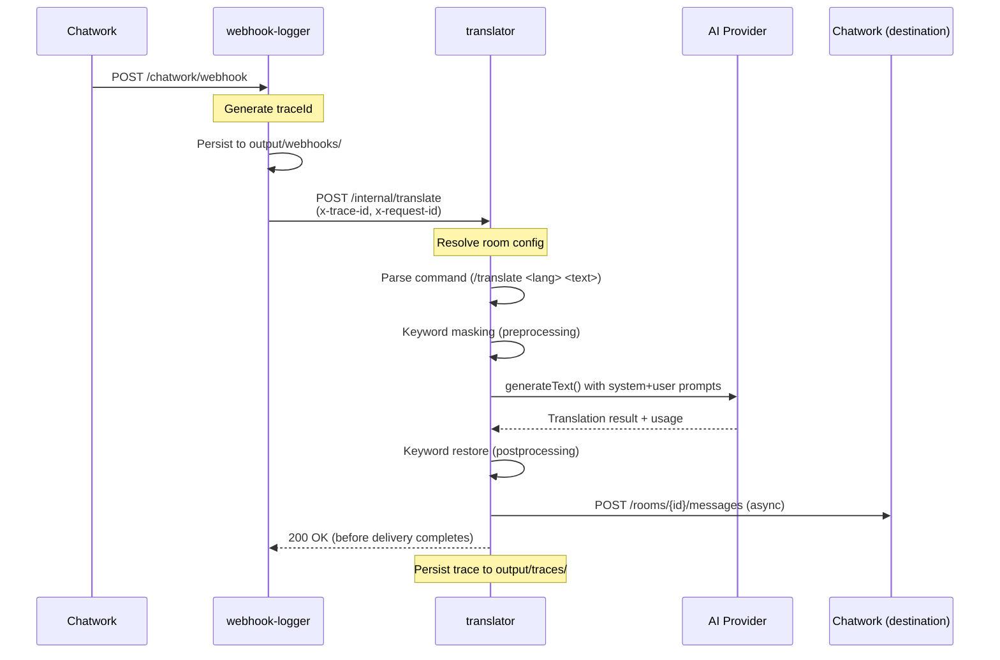

# Architecture Patterns

## Request Flow (Current)



**Fire-and-forget pattern**: The webhook handler returns 200 OK immediately and processes
the translation asynchronously. This prevents Chatwork from retrying on slow responses.

## Routing & Configuration

### Webhook Path

- **Entry:** `webhook-logger` receives at `/chatwork/webhook`
- **Persistence:** Saves raw payload to `output/webhooks/YYYY-MM-DD/`
- **Forward:** Calls `translator` at `/internal/translate` with:
  - `x-trace-id`: UUID for request correlation
  - `x-request-id`: Sequential counter for ordering
  - Full webhook payload body

### Translation Path

- **Entry:** `translator` router creates `TranslatorRequestContext`
- **Handler:** `handleTranslateRequest` resolves room configuration
- **Orchestrator:** `orchestrateRoomTranslation` manages pipeline:
  1. Preprocessing (keyword masking, tag parsing)
  2. LLM call (single `executor.execute()`)
  3. Postprocessing (keyword restore, tag addition)
  4. Delivery (async fire-and-forget to Chatwork)
- **Tracing:** `TraceBuilder` instruments each stage, persists to `output/traces/`

### Per-Room Configuration

**NEW (Phase 1+):** Room settings moved from global env to per-room dashboard config:

- `aiProvider`: gemini | openai | cursor (local dev)
- `model`: gemini-2.0-flash-exp | gpt-5.4-mini | etc.
- `translationStyle`: NATURAL_CASUAL | PROFESSIONAL_BUSINESS | TECHNICAL
- `temperature`: 0.0-1.0 (per-style defaults)
- `keywords`: Array of keyword protection rules

**Fallback:** If room not configured, uses `DEFAULT_*` env vars.

## Plugin Registry Pattern

Translation providers are implemented as plugins that register with a central registry at
startup. The `TranslationServiceFactory` no longer exists — the registry is the only path
to create translation service instances.

### How to add a new provider

1. Create `packages/provider-<name>/` with `package.json`, `tsconfig.json`, `src/`
2. Define model values locally: `export const <NAME>_MODEL_VALUES = [...] as const`
3. Implement `ProviderPlugin` interface with manifest (including `requiredEnvKeys`)
4. Export the plugin object from `src/<name>-plugin.ts`
5. Register in `packages/translator/src/bootstrap/register-providers.ts`

No changes to `core` needed. Model validation happens at startup via guards.

### Provider lifecycle

```
startup → registerAllProviders() → runStartupGuards() → server.listen()
request → getProviderPlugin(id) → plugin.create(ctx) → service.translate()
```

## Execution Policy

All translation calls go through `translateWithPolicy()`:

- **Timeout**: 10 seconds per attempt
- **Retry**: Up to 1 retry (2 total attempts) for transient `API_ERROR` only
- **Backoff**: Exponential (300ms base, factor 2)
- Non-transient errors (`QUOTA_EXCEEDED`, `INVALID_RESPONSE`) fail immediately

## Chatwork Markup Stripping

`stripChatworkMarkup()` removes these tags from message text before translation:

- `[To:xxx]` — mention tags
- `[rp aid=...]` — reply tags
- `[quote]...[/quote]` — quoted messages
- `[info]...[/info]` — info blocks
- `[title]...[/title]` — title tags
- `[code]...[/code]` — code blocks

## Env Validation Pattern

Zod schema with flat validation is parsed **at module load** in `packages/translator/src/env.ts`.
It validates base fields (`CHATWORK_API_TOKEN`, `AI_PROVIDER`, etc.) and exports a typed `env` singleton.

Provider-specific keys (e.g., `GOOGLE_GENERATIVE_AI_API_KEY`) are validated by startup guards
**after** provider registration, using `manifest.requiredEnvKeys`.

```typescript
import { env } from '~/env'
const token = env.CHATWORK_API_TOKEN
```

If a required variable is missing, startup guards throw `ProviderRegistryBootError` with a clear message.
Model validation also happens at startup — models not in `manifest.supportedModels` log a warning (escape hatch).

## Runtime Endpoints

| Endpoint              | Method | Package    | Purpose                                 |
| --------------------- | ------ | ---------- | --------------------------------------- |
| `/health`             | GET    | both       | Health check (returns 200 OK)           |
| `/health/provider`    | GET    | translator | Provider registry detail (JSON)         |
| `/webhook`            | POST   | logger     | Chatwork webhook receiver               |
| `/internal/translate` | POST   | translator | Internal translate (shared-secret auth) |

## Docker Service Networking (Dev + Prod)

When running via Docker Compose, services communicate over the `chatwork-net` bridge network
using Docker service names — **not** `localhost`:

| From           | To           | URL                                   |
| -------------- | ------------ | ------------------------------------- |
| webhook-logger | translator   | `http://translator:3000`              |
| translator     | cursor-proxy | `http://host.docker.internal:8765/v1` |

This is injected automatically via `environment:` in the compose files. The `.env` file
keeps `TRANSLATOR_URL=http://localhost:3000` for native dev (without Docker).

For `cursor` provider: cursor-proxy runs **natively on macOS** (not in Docker).
`host.docker.internal` is Docker Desktop for Mac's built-in hostname that resolves
to the macOS host IP — no extra config needed.

## Plugin-Owned Architecture

Each provider package owns its model list, required env keys, and capabilities. Core defines only interfaces.

**Provider manifest includes:**

- `supportedModels: readonly string[]` — owned by provider
- `defaultModel: string`
- `requiredEnvKeys: readonly string[]` — validated at startup
- `timeoutMs?: number` — optional per-provider timeout

**Adding a new provider requires:**

- Creating the provider package with local model definitions
- One import line in `register-providers.ts`
- Zero changes to `core`, `env.ts`, or other packages

See `docs/plans/2026-03-06-plugin-owned-provider-architecture-design.md` for full design rationale.

## Dataset-Driven Flow (Local Dev Only)

The dataset-runner sidecar enables automated, ordered translation testing via JSONL batch files.

```
dataset-runner
→ reads item from input/pending/*.jsonl
→ POST Chatwork API (CHATWORK_ORIGINAL_ROOM_ID) — injects message
→ waits for ACK (blocks queue)

webhook-logger
→ receives Chatwork webhook event for that message
→ forwards to translator /internal/translate

translator
→ translates, logs result
→ POST DATASET_RUNNER_CALLBACK_URL (/internal/delivery-acks) — ACK

dataset-runner
→ receives ACK → advances to next item
```

### ACK Callback as Queue Synchronization Primitive

The ACK callback (`POST /internal/delivery-acks`) is the **only** mechanism that advances
the dataset-runner queue. This replaces polling and ensures strict ordering: one item is
in-flight at a time. The callback URL is injected by dataset-runner into each translate
request; the translator fires it after writing the translation result.

- Endpoint: internal Docker network only (port 3002, no host binding)
- If ACK does not arrive within `DATASET_ITEM_TIMEOUT_MS`, the item is retried or moved to DLQ
- `DATASET_RUNNER_CALLBACK_URL` is set in `.env.example` for local dev; it is consumed by
  the translator package (not defined in dataset-runner's own env schema)

### `origin.type` Observability

Every translation request carries an `origin` field in the structured log output:

| Value        | Meaning                                              |
| ------------ | ---------------------------------------------------- |
| `manual`     | Triggered by a real Chatwork webhook (human message) |
| `automation` | Injected by dataset-runner                           |

This allows filtering logs by source to separate manual usage from test runs.
