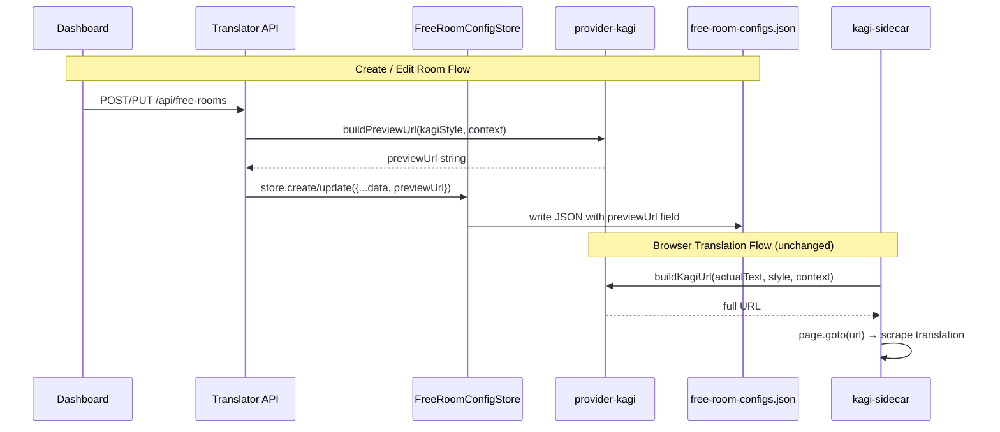

# Preview URL for Free Room Config - Design Document

**Version:** 1.0  
**Date:** 2026-04-09  
**Prepared by:** AI-assisted (with user confirmation)  
**Status:** Approved - Ready for Implementation

---

## Table of Contents

- [Objective](#objective)
- [Scope](#scope)
- [Non-Goals](#non-goals)
- [Definition of Done](#definition-of-done)
- [Constraints](#constraints)
- [Architecture](#architecture)
- [Data Model](#data-model)
- [Technical Approach](#technical-approach)
- [API Behavior](#api-behavior)
- [Testing Strategy](#testing-strategy)
- [Migration & Backward Compatibility](#migration--backward-compatibility)
- [Deployment & Operations](#deployment--operations)
- [Edge Cases & Error Handling](#edge-cases--error-handling)
- [Explicit Decisions](#explicit-decisions)
- [Verification](#verification)

---

## Objective

Add a computed `previewUrl` field to free room configs that contains the full Kagi Translate URL with the room's translation style and context settings.

**Use Case:** User opens `data/free-room-configs.json`, copies `previewUrl`, replaces `hello` with actual text, pastes into browser to verify translation results before deployment.

**Problem:** Currently, users have no easy way to preview how Kagi Translate will behave with their chosen `kagiStyle` and `context` settings. Manual URL construction is error-prone and time-consuming.

**Solution:** Automatically compute and store the preview URL when rooms are created or updated, ensuring it matches 100% with the URL that `kagi-sidecar` browser automation will use.

---

## Scope

### In-Scope

✅ Add `previewUrl` field to `FreeRoomConfigSchema` (required)  
✅ Consolidate `buildKagiUrl()` from kagi-sidecar into provider-kagi  
✅ Compute `previewUrl` when creating/updating rooms  
✅ Move helper functions (mapFormality, mapReadingLevel, etc.) to provider-kagi  
✅ Update kagi-sidecar imports to use provider-kagi  
✅ Move test suite from kagi-sidecar to provider-kagi  
✅ Add `buildPreviewUrl()` convenience wrapper

### Out-of-Scope

❌ Dashboard UI to display/copy previewUrl (user opens JSON file directly)  
❌ Manual migration script (not needed - current rooms array is empty)  
❌ Feature flags or gradual rollout  
❌ Logging for previewUrl computation  
❌ E2E API tests (unit + integration tests sufficient)

---

## Non-Goals

- **No UI changes:** Dashboard will not display `previewUrl` field initially (may be added in future)
- **No auto-migration:** Rooms lacking `previewUrl` will fail schema validation (strict enforcement)
- **No custom encoding:** Use URLSearchParams native encoding (RFC 3986 compliant)
- **No observability overhead:** No logging for deterministic computed fields

---

## Definition of Done

- [ ] `previewUrl` field exists in all rooms created/updated via API
- [ ] User can open `data/free-room-configs.json`, copy previewUrl, paste into browser
- [ ] Preview URL exactly matches URL that kagi-sidecar browser automation uses
- [ ] All tests pass: `bun test && bun typecheck && bun lint`
- [ ] Zero duplication: `buildKagiUrl` exists only in provider-kagi
- [ ] Schema validation rejects rooms without `previewUrl`
- [ ] All 12 KagiStyle presets generate correct URLs
- [ ] Context parameter handling matches existing behavior

---

## Constraints

### Technical Constraints

- **Computed field:** `previewUrl` is server-computed, not sent by client
- **URL format:** `https://translate.kagi.com/?from=auto&to=vi&text=hello&...`
- **Default text:** Always use `"hello"` as placeholder text parameter
- **Context handling:** Only add `?context=<value>` if context is non-empty string after trim()
- **URL encoding:** Use URLSearchParams native encoding (RFC 3986)
- **Schema:** `previewUrl: z.string().url()` - required field

### Business Constraints

- Must maintain single source of truth (no drift between preview and actual URLs)
- Must not break existing kagi-sidecar functionality
- Must preserve Dashboard metadata (KAGI_STYLE_LABELS, KAGI_STYLE_DESCRIPTIONS)

---

## Architecture

### Decision: Consolidate URL Builder into provider-kagi

**Current State:**

| Package       | Has KAGI_STYLE_PRESETS   | Has buildKagiUrl | Has mapping functions |
| ------------- | ------------------------ | ---------------- | --------------------- |
| provider-kagi | ✅ (with label field)    | ❌               | ❌                    |
| kagi-sidecar  | ✅ (duplicate, no label) | ✅               | ✅                    |

**After Change:**

| Package       | Has KAGI_STYLE_PRESETS          | Has buildKagiUrl | Has mapping functions |
| ------------- | ------------------------------- | ---------------- | --------------------- |
| provider-kagi | ✅ (source of truth)            | ✅ (moved)       | ✅ (moved)            |
| kagi-sidecar  | ❌ (imports from provider-kagi) | ❌ (imports)     | ❌ (imports)          |

### Rationale

**Source of Truth:** provider-kagi KAGI_STYLE_PRESETS (with label field)

**Why this structure:**

1. ✅ All 12 styles have **identical** `{translationType, formality, readingLevel}` values
2. ✅ Extra `label` field doesn't break `buildKagiUrl` logic (TypeScript structural typing)
3. ✅ Dashboard retains UI metadata (labels, descriptions)
4. ✅ kagi-sidecar code becomes ~183 lines simpler
5. ✅ Zero drift risk - single implementation

**Trade-offs:**

- **Pro:** Single source of truth, zero drift risk
- **Pro:** kagi-sidecar reduces ~90 lines of duplicated code
- **Pro:** provider-kagi remains zero external dependencies (only native URLSearchParams)
- **Con:** kagi-sidecar adds workspace dependency (minimal impact)

### Data Flow



---

## Data Model

### Schema Changes

**File:** `packages/translator/src/types/free-room-config.ts`

Add `previewUrl` field to `FreeRoomConfigSchema`:

```typescript
export const FreeRoomConfigSchema = z.object({
  id: z.uuid(),
  originalRoomId: z.number().int().positive(),
  originalRoomName: z.string().min(1),
  destinationRoomId: z.number().int().positive(),
  destinationRoomName: z.string().min(1),
  kagiStyle: z.enum(FREE_ROOM_KAGI_STYLE_VALUES).default('Clear'),
  context: z.string().max(100).nullable().optional().default(null),
  previewUrl: z.string().url(), // ← NEW: Required field
  protectedKeywords: z.array(KeywordEntrySchema).max(50).optional(),
  enabled: z.boolean(),
  createdAt: z.iso.datetime(),
  updatedAt: z.iso.datetime(),
})
```

**Position:** After `context`, before `protectedKeywords` (logical grouping with translation config)

### Field Specification

| Field        | Type               | Required | Description                               |
| ------------ | ------------------ | -------- | ----------------------------------------- |
| `previewUrl` | `z.string().url()` | ✅ Yes   | Full Kagi Translate URL with `text=hello` |

### Example JSON Output

```json
{
  "id": "abc-123",
  "originalRoomId": 123456,
  "originalRoomName": "JP Project Demo",
  "destinationRoomId": 789012,
  "destinationRoomName": "JP Project Demo (VN)",
  "kagiStyle": "Wild",
  "context": "software team",
  "previewUrl": "https://translate.kagi.com/?from=auto&to=vi&text=hello&preserveFormatting=true&formality=less&formality_context=vi_casual&language_complexity=c2&context=software+team",
  "protectedKeywords": [],
  "enabled": true,
  "createdAt": "2026-04-09T10:00:00.000Z",
  "updatedAt": "2026-04-09T10:00:00.000Z"
}
```

### Computation Behavior

**On `create()`:**

- Compute `previewUrl` from `params.kagiStyle` + `params.context`
- Use `buildPreviewUrl(params.kagiStyle, params.context)`

**On `update()`:**

- Recompute `previewUrl` from merged state
- If `patch.kagiStyle` provided → use new value
- If `patch.context` provided → use new value
- If neither changed → use existing values
- Always recompute to ensure consistency

---

## Technical Approach

### Component 1: provider-kagi - Add url-builder.ts

**New File:** `packages/provider-kagi/src/url-builder.ts`

**Move from kagi-sidecar:**

```typescript
// Constants
const KAGI_TRANSLATE_BASE_URL = 'https://translate.kagi.com/'

// Types (internal)
type KagiTranslationType = 'natural' | 'literal'
type KagiFormality = 'standard' | 'vietnamese_formal' | 'vietnamese_casual'
type KagiReadingLevel = 'standard' | 'a2' | 'b2' | 'c1' | 'c2'
type KagiStyleQuery = Readonly<{
  formality?: 'less' | 'more'
  formalityContext?: string
  languageComplexity?: Exclude<KagiReadingLevel, 'standard'>
  style?: 'literal'
}>

// Helper functions (move as-is)
function mapFormality(
  formality: KagiFormality,
): Pick<KagiStyleQuery, 'formality' | 'formalityContext'>
function mapReadingLevel(readingLevel: KagiReadingLevel): Pick<KagiStyleQuery, 'languageComplexity'>
function mapTranslationType(translationType: KagiTranslationType): Pick<KagiStyleQuery, 'style'>
function getStyleQuery(style: KagiStyle): KagiStyleQuery

// Main function (move as-is)
export function buildKagiUrl(text: string, style: KagiStyle, context?: string): string
```

**Add new function:**

```typescript
/**
 * Build preview URL with default "hello" text for manual testing.
 *
 * @param style - KagiStyle preset (e.g., "Wild", "Clear")
 * @param context - Optional context string (null/undefined/empty → no context param)
 * @returns Full Kagi Translate URL with text=hello
 *
 * @example
 * buildPreviewUrl('Wild', 'software team')
 * // → "https://translate.kagi.com/?from=auto&to=vi&text=hello&...&context=software+team"
 *
 * buildPreviewUrl('Clear', null)
 * // → "https://translate.kagi.com/?from=auto&to=vi&text=hello&..."
 */
export function buildPreviewUrl(style: KagiStyle, context?: string | null): string {
  return buildKagiUrl('hello', style, context ?? undefined)
}
```

**Export:**

Update `packages/provider-kagi/src/index.ts`:

```typescript
export * from './url-builder'
```

**Dependencies:**

Uses existing `KAGI_STYLE_PRESETS` from `./types.ts` (same package, no new dependencies)

---

### Component 2: kagi-sidecar - Cleanup Duplication

**Update package.json:**

```json
{
  "dependencies": {
    "@chatwork-bot/provider-kagi": "workspace:*"
  }
}
```

**Delete files:**

- ❌ `packages/kagi-sidecar/src/url-builder.ts` (entire ~183 lines)
- ❌ `packages/kagi-sidecar/src/url-builder.test.ts` (moved to provider-kagi)

**Update imports:**

| File                      | Old Import                                       | New Import                           |
| ------------------------- | ------------------------------------------------ | ------------------------------------ |
| `browser-service.ts`      | `from './url-builder'`                           | `from '@chatwork-bot/provider-kagi'` |
| `server.ts`               | `from './url-builder'`                           | `from '@chatwork-bot/provider-kagi'` |
| `browser-service.test.ts` | `import type { KagiStyle } from './url-builder'` | `from '@chatwork-bot/provider-kagi'` |

**Update exports:**

`packages/kagi-sidecar/src/index.ts`:

- ❌ Remove: `export * from './url-builder'`

---

### Component 3: translator - Add previewUrl Computation

**File:** `packages/translator/src/services/free-room-config-store.ts`

**Add import:**

```typescript
import { buildPreviewUrl } from '@chatwork-bot/provider-kagi'
```

**Update `create()` method:**

```typescript
async create(params: CreateFreeRoomStoreParams): Promise<FreeRoomConfig> {
  return this.withMutex(async () => {
    if (this.roomsByOriginalId.has(params.originalRoomId)) {
      throw new FreeRoomConfigStoreError(
        `originalRoomId ${params.originalRoomId.toString()} already exists`,
        'DUPLICATE_ORIGINAL_ROOM_ID',
      )
    }

    const now = new Date().toISOString()

    // Compute previewUrl
    const previewUrl = buildPreviewUrl(params.kagiStyle, params.context)

    const room: FreeRoomConfig = {
      id: crypto.randomUUID(),
      originalRoomId: params.originalRoomId,
      originalRoomName: params.originalRoomName,
      destinationRoomId: params.destinationRoomId,
      destinationRoomName: params.destinationRoomName,
      kagiStyle: params.kagiStyle,
      context: params.context ?? null,
      previewUrl,  // ← Add computed field
      ...(params.protectedKeywords !== undefined
        ? { protectedKeywords: params.protectedKeywords }
        : {}),
      enabled: true,
      createdAt: now,
      updatedAt: now,
    }

    const rooms = this.allRooms()
    rooms.push(room)

    await this.writeConfig({ version: 1, rooms })
    this.rebuildIndex(rooms)

    return room
  })
}
```

**Update `update()` method:**

```typescript
async update(id: string, patch: UpdateFreeRoomRequest): Promise<FreeRoomConfig> {
  return this.withMutex(async () => {
    const existing = this.roomsById.get(id)
    if (existing === undefined) {
      throw new FreeRoomConfigStoreError(`Room ${id} not found`, 'NOT_FOUND')
    }

    const updated: FreeRoomConfig = {
      ...existing,
      ...(patch.destinationRoomName !== undefined
        ? { destinationRoomName: patch.destinationRoomName }
        : {}),
      ...(patch.kagiStyle !== undefined ? { kagiStyle: patch.kagiStyle } : {}),
      ...(patch.context !== undefined ? { context: patch.context } : {}),
      ...(patch.protectedKeywords !== undefined
        ? { protectedKeywords: patch.protectedKeywords }
        : {}),
      updatedAt: new Date().toISOString(),
    }

    // Recompute previewUrl from merged state
    const previewUrl = buildPreviewUrl(updated.kagiStyle, updated.context)
    updated.previewUrl = previewUrl

    const rooms = this.allRooms().map((room) => (room.id === id ? updated : room))
    await this.writeConfig({ version: 1, rooms })
    this.rebuildIndex(rooms)

    return updated
  })
}
```

**No changes needed:**

- `packages/translator/src/routes/free-rooms.ts` - Factory auto-returns store data
- `packages/translator/src/routes/create-room-routes-factory.ts` - Pass-through, no field filtering
- `packages/dashboard/*` - Receives field but doesn't display

---

## API Behavior

### Endpoints Affected

**GET /api/free-rooms**

- Returns: Array of `FreeRoomConfig` objects
- Change: Each object includes `previewUrl` field
- No request schema changes

**POST /api/free-rooms**

- Request: `CreateFreeRoomRequest` (no previewUrl field - computed server-side)
- Response: Created `FreeRoomConfig` with `previewUrl`
- Validation: previewUrl not accepted in request body

**PUT /api/free-rooms/:id**

- Request: `UpdateFreeRoomRequest` (no previewUrl field - recomputed server-side)
- Response: Updated `FreeRoomConfig` with recomputed `previewUrl`
- Validation: previewUrl not accepted in request body

### Request/Response Examples

**POST /api/free-rooms**

Request:

```json
{
  "originalRoomId": 123456,
  "originalRoomName": "JP Project",
  "destinationRoomName": "JP Project (VN)",
  "kagiStyle": "Wild",
  "context": "software team"
}
```

Response (201 Created):

```json
{
  "id": "abc-123",
  "originalRoomId": 123456,
  "originalRoomName": "JP Project",
  "destinationRoomId": 789012,
  "destinationRoomName": "JP Project (VN)",
  "kagiStyle": "Wild",
  "context": "software team",
  "previewUrl": "https://translate.kagi.com/?from=auto&to=vi&text=hello&preserveFormatting=true&formality=less&formality_context=vi_casual&language_complexity=c2&context=software+team",
  "protectedKeywords": [],
  "enabled": true,
  "createdAt": "2026-04-09T10:00:00.000Z",
  "updatedAt": "2026-04-09T10:00:00.000Z"
}
```

**PUT /api/free-rooms/abc-123**

Request:

```json
{
  "kagiStyle": "Clear"
}
```

Response (200 OK):

```json
{
  "id": "abc-123",
  "kagiStyle": "Clear",
  "context": "software team",
  "previewUrl": "https://translate.kagi.com/?from=auto&to=vi&text=hello&preserveFormatting=true&context=software+team",
  "updatedAt": "2026-04-09T10:05:00.000Z"
}
```

---

## Testing Strategy

### Test Coverage Layers

1. **Unit tests:** provider-kagi url-builder
2. **Unit tests:** translator store
3. **Integration tests:** kagi-sidecar imports

### provider-kagi Tests

**File:** `packages/provider-kagi/src/url-builder.test.ts`

**Move from kagi-sidecar:**

- All existing `buildKagiUrl()` tests
- Test all 12 KagiStyle presets
- Test context parameter handling

**Add new tests for `buildPreviewUrl()`:**

```typescript
describe('buildPreviewUrl', () => {
  it('should build preview URL with context', () => {
    const url = buildPreviewUrl('Wild', 'software team')
    expect(url).toContain('text=hello')
    expect(url).toContain('context=software+team')
  })

  it('should build preview URL without context (null)', () => {
    const url = buildPreviewUrl('Clear', null)
    expect(url).toContain('text=hello')
    expect(url).not.toContain('context=')
  })

  it('should build preview URL without context (undefined)', () => {
    const url = buildPreviewUrl('Smart')
    expect(url).toContain('text=hello')
    expect(url).not.toContain('context=')
  })

  it('should build preview URL without context (empty string)', () => {
    const url = buildPreviewUrl('Deep', '')
    expect(url).toContain('text=hello')
    expect(url).not.toContain('context=')
  })

  it('should build preview URL without context (whitespace)', () => {
    const url = buildPreviewUrl('Fine', '   ')
    expect(url).toContain('text=hello')
    expect(url).not.toContain('context=')
  })

  it('should encode special characters in context', () => {
    const url = buildPreviewUrl('Polite', 'test & data')
    expect(url).toContain('text=hello')
    expect(url).toContain('context=test+%26+data')
  })

  it('should handle unicode context', () => {
    const url = buildPreviewUrl('Elegant', 'ソフトウェア')
    expect(url).toContain('text=hello')
    expect(url).toContain('context=')
    expect(decodeURIComponent(url)).toContain('ソフトウェア')
  })
})
```

### translator Tests

**File:** `packages/translator/src/services/free-room-config-store.test.ts`

**Add/update tests:**

```typescript
describe('FreeRoomConfigStore', () => {
  describe('create', () => {
    it('should include previewUrl in created room', async () => {
      const room = await store.create({
        originalRoomId: 123,
        originalRoomName: 'Test',
        destinationRoomId: 456,
        destinationRoomName: 'Test VN',
        kagiStyle: 'Wild',
        context: 'software',
      })

      expect(room.previewUrl).toBeDefined()
      expect(room.previewUrl).toMatch(/^https:\/\/translate\.kagi\.com\//)
      expect(room.previewUrl).toContain('text=hello')
      expect(room.previewUrl).toContain('context=software')
    })

    it('should create previewUrl without context when null', async () => {
      const room = await store.create({
        originalRoomId: 123,
        originalRoomName: 'Test',
        destinationRoomId: 456,
        destinationRoomName: 'Test VN',
        kagiStyle: 'Clear',
        context: null,
      })

      expect(room.previewUrl).toBeDefined()
      expect(room.previewUrl).not.toContain('context=')
    })
  })

  describe('update', () => {
    it('should recompute previewUrl when kagiStyle changes', async () => {
      const created = await store.create({
        originalRoomId: 123,
        originalRoomName: 'Test',
        destinationRoomId: 456,
        destinationRoomName: 'Test VN',
        kagiStyle: 'Wild',
        context: 'software',
      })

      const updated = await store.update(created.id, {
        kagiStyle: 'Clear',
      })

      expect(updated.previewUrl).toBeDefined()
      expect(updated.previewUrl).not.toBe(created.previewUrl)
      expect(updated.previewUrl).toContain('text=hello')
    })

    it('should recompute previewUrl when context changes', async () => {
      const created = await store.create({
        originalRoomId: 123,
        originalRoomName: 'Test',
        destinationRoomId: 456,
        destinationRoomName: 'Test VN',
        kagiStyle: 'Wild',
        context: 'software',
      })

      const updated = await store.update(created.id, {
        context: 'testing',
      })

      expect(updated.previewUrl).toBeDefined()
      expect(updated.previewUrl).not.toBe(created.previewUrl)
      expect(updated.previewUrl).toContain('context=testing')
    })

    it('should keep previewUrl consistent when style/context unchanged', async () => {
      const created = await store.create({
        originalRoomId: 123,
        originalRoomName: 'Test',
        destinationRoomId: 456,
        destinationRoomName: 'Test VN',
        kagiStyle: 'Wild',
        context: 'software',
      })

      const updated = await store.update(created.id, {
        destinationRoomName: 'New Name',
      })

      expect(updated.previewUrl).toBe(created.previewUrl)
    })
  })
})
```

### kagi-sidecar Integration Tests

**Files:**

- `packages/kagi-sidecar/src/browser-service.test.ts`
- `packages/kagi-sidecar/src/server.test.ts`

**Changes:**

- Update imports: `from '@chatwork-bot/provider-kagi'`
- Verify existing tests still pass
- No new test cases needed (existing tests verify integration)

### Test Execution

```bash
# Run all tests
bun test

# Run specific package tests
bun test --filter provider-kagi
bun test --filter translator
bun test --filter kagi-sidecar

# Run with coverage
bun test --coverage
```

---

## Migration & Backward Compatibility

### Current State

`data/free-room-configs.json`:

```json
{
  "version": 1,
  "rooms": []
}
```

**Status:** Empty array - no existing rooms to migrate.

### Migration Strategy

**Approach:** Strict schema validation - no auto-migration

**Rationale:**

- Current rooms array is empty → no backward compatibility issues
- Future manual edits must comply with schema
- Fail-fast approach prevents silent data corruption
- Clear error messages guide manual fixes

### Validation Behavior

**On server startup:**

1. Load `free-room-configs.json`
2. Parse with `FreeRoomConfigFileSchema`
3. If any room lacks `previewUrl`:
   - ❌ Schema validation FAILS
   - ❌ Server FAILS to start
   - ✅ Clear error message: "Invalid config: room {id} missing required field 'previewUrl'"
4. Admin must fix JSON manually
5. Restart server

**On API requests:**

- `create()`: Always computes previewUrl → new rooms always valid
- `update()`: Always recomputes previewUrl → updated rooms always valid
- Manual JSON edits: Validated on next server startup

### No Auto-Migration Rationale

**Why not auto-migrate:**

1. Current rooms=[] → no migration needed now
2. Strict validation catches data inconsistencies early
3. Auto-migration adds complexity for zero immediate benefit
4. Manual fixes force awareness of schema changes
5. Preview URL is deterministic - easy to fix manually if needed

**If future manual JSON edits break schema:**

- Error message clearly indicates missing field
- Admin can either:
  - Add previewUrl manually (copy from another room, adjust params)
  - Delete room and recreate via API
  - Run simple script: `rooms.forEach(r => r.previewUrl = buildPreviewUrl(r.kagiStyle, r.context))`

---

## Deployment & Operations

### Deployment Strategy

**Approach:** Immediate strict deployment

**Steps:**

1. Deploy new code to production
2. Server restarts
3. Loads `free-room-configs.json`
4. Schema validation passes (rooms=[])
5. API ready to create rooms with previewUrl

**No pre-deployment checks needed:**

- Current file has zero rooms
- Schema change is additive (computed field)
- No manual migration required

### Rollback Plan

**If deployment fails:**

1. Check server logs for validation errors
2. If schema validation error:
   - Verify JSON file format
   - Fix any manually-added rooms lacking previewUrl
   - Restart server
3. If functional error:
   - Rollback code deployment
   - Previous version reads JSON without previewUrl field (backwards compatible read)

**Rollback safety:**

- Old code doesn't require previewUrl field
- New rooms created by old code will lack previewUrl
- Upgrading again will fail validation → clear error message

### Monitoring

**No special monitoring needed:**

- Computed field is deterministic
- No external dependencies
- No failure modes

**Verify deployment success:**

```bash
# Check server started successfully
curl http://localhost:3000/health

# Create test room
curl -X POST http://localhost:3000/api/free-rooms \
  -H "Content-Type: application/json" \
  -d '{"originalRoomId":999,"originalRoomName":"Test","destinationRoomName":"Test VN","kagiStyle":"Clear"}'

# Verify previewUrl in response
cat data/free-room-configs.json | jq '.rooms[].previewUrl'
```

### Operational Concerns

**Disk space:** Negligible (URL ~150-250 chars per room)

**Performance:** No impact (computed during write, not read)

**Failure modes:** None (pure function, no I/O)

---

## Edge Cases & Error Handling

### Context Parameter Edge Cases

| Input             | Behavior          | URL Contains context? | Notes                             |
| ----------------- | ----------------- | --------------------- | --------------------------------- |
| `null`            | Treated as absent | ❌ No                 | Default value in schema           |
| `undefined`       | Treated as absent | ❌ No                 | Optional parameter                |
| `''`              | Treated as absent | ❌ No                 | Empty after trim()                |
| `'   '`           | Treated as absent | ❌ No                 | Whitespace-only, trimmed to empty |
| `'software'`      | Added to URL      | ✅ Yes                | `context=software`                |
| `'software team'` | Encoded + added   | ✅ Yes                | `context=software+team`           |
| `'test & data'`   | Percent-encoded   | ✅ Yes                | `context=test+%26+data`           |
| `'ソフトウェア'`  | Percent-encoded   | ✅ Yes                | Unicode handled correctly         |
| `'test 🚀'`       | Percent-encoded   | ✅ Yes                | Emoji handled correctly           |

### URL Encoding

**Mechanism:** URLSearchParams native encoding (RFC 3986)

**Special characters handled:**

- Spaces → `+` or `%20`
- `&` → `%26`
- `=` → `%3D`
- Unicode → UTF-8 percent-encoded
- Emoji → UTF-8 percent-encoded

**No custom encoding logic needed** - URLSearchParams handles all cases correctly.

### Schema Validation

**Valid previewUrl:**

- Must be valid URL (Zod `.url()` validator)
- Must start with `https://translate.kagi.com/`
- Must contain `text=hello`

**Invalid previewUrl:**

- Not a valid URL → Validation FAILS
- Empty string → Validation FAILS
- Null/undefined → Validation FAILS

**Validation failure behavior:**

- Server fails to start
- Clear error message with field path
- Admin must fix JSON

### Error Scenarios

| Scenario              | Detection                 | Behavior              | Recovery                  |
| --------------------- | ------------------------- | --------------------- | ------------------------- |
| Room lacks previewUrl | Schema validation on load | Server fails to start | Admin fixes JSON manually |
| Invalid URL format    | Schema validation on load | Server fails to start | Admin fixes JSON manually |
| buildKagiUrl throws   | Never (pure function)     | N/A                   | N/A                       |
| URLSearchParams fails | Never (native API)        | N/A                   | N/A                       |

**No error handling code needed** - all failure modes are prevented by:

1. Type safety (TypeScript)
2. Schema validation (Zod)
3. Pure functions (deterministic, no I/O)

---

## Explicit Decisions

All decisions confirmed by user during brainstorming phase.

### [DEC-001] KAGI_STYLE_PRESETS Structure

**Decision:** Use provider-kagi structure (with label field) as source of truth  
**Status:** ✅ Accepted  
**Provenance:** User-confirmed  
**Risk:** Low  
**Rationale:** All 12 styles have identical `{translationType, formality, readingLevel}` values. Extra `label` field doesn't break buildKagiUrl logic (TypeScript structural typing allows it). Dashboard retains UI metadata.

### [DEC-002] Context Parameter Handling

**Decision:** Only add `?context=<value>` when non-empty after trim()  
**Status:** ✅ Accepted  
**Provenance:** User-stated  
**Risk:** Low  
**Rationale:** Matches existing buildKagiUrl logic. Null/undefined/empty all treated consistently - no context param in URL.

### [DEC-003] previewUrl Schema

**Decision:** previewUrl is required field (`z.string().url()`)  
**Status:** ✅ Accepted  
**Provenance:** User-stated  
**Risk:** Low  
**Rationale:** buildKagiUrl is pure function with no failure modes given valid inputs. No need for optional fallback.

### [DEC-004] Migration Strategy

**Decision:** Strict schema validation - no auto-migration  
**Status:** ✅ Accepted  
**Provenance:** User-stated  
**Risk:** Low  
**Rationale:** Current rooms=[] so no backward compatibility issues. Fail-fast prevents silent data corruption.

### [DEC-005] Deployment Approach

**Decision:** Immediate strict deployment, no pre-checks  
**Status:** ✅ Accepted  
**Provenance:** User-stated  
**Risk:** Low  
**Rationale:** Safe because rooms=[] currently. If future rooms lack previewUrl, server fails with clear error.

### [DEC-006] Test Coverage

**Decision:** Unit + Integration tests (no E2E)  
**Status:** ✅ Accepted  
**Provenance:** User-stated  
**Risk:** Low  
**Layers:** (1) provider-kagi url-builder unit, (2) translator store unit, (3) kagi-sidecar integration

### [DEC-007] URL Encoding

**Decision:** Use URLSearchParams native encoding  
**Status:** ✅ Accepted  
**Provenance:** User-stated  
**Risk:** Low  
**Rationale:** RFC 3986 compliant, handles special chars/unicode/emoji correctly, no custom logic needed.

### [DEC-008] Observability

**Decision:** No logging for previewUrl computation  
**Status:** ✅ Accepted  
**Provenance:** User-stated  
**Risk:** Low  
**Rationale:** Deterministic computed field, no external dependencies or failure modes. Devs can inspect JSON directly.

### [DEC-009] API Response

**Decision:** API returns previewUrl in response JSON  
**Status:** ✅ Accepted  
**Provenance:** User-stated  
**Risk:** Low  
**Rationale:** Store returns FreeRoomConfig with previewUrl, API pass-through without filtering. Dashboard receives field but doesn't display initially.

### [DEC-010] Dashboard UI

**Decision:** No Dashboard UI for previewUrl  
**Status:** ✅ Accepted  
**Provenance:** User-stated  
**Risk:** Low  
**Rationale:** Use case: user opens JSON file to copy previewUrl. No scope expansion for UI feature.

### [DEC-011] buildPreviewUrl Signature

**Decision:** `buildPreviewUrl(style: KagiStyle, context?: string | null): string`  
**Status:** ✅ Accepted  
**Provenance:** User-stated  
**Risk:** Low  
**Rationale:** Accepts string | null | undefined. Matches FreeRoomConfig schema. No conversion boilerplate needed.

---

## Verification

### Pre-Implementation Checklist

- [ ] All decision points documented
- [ ] No material ambiguities remaining
- [ ] Trade-offs explicitly stated
- [ ] Edge cases identified and handled
- [ ] Test strategy defined
- [ ] Deployment plan clear
- [ ] Rollback plan clear

### Implementation Verification

Run after each component change:

```bash
# Type check
bun run typecheck

# Lint
bun run lint

# Unit tests
bun test --filter provider-kagi
bun test --filter translator
bun test --filter kagi-sidecar

# Full suite
bun test
```

### Functional Verification

**Test Case 1: Create room with context**

```bash
# Create room
curl -X POST http://localhost:3000/api/free-rooms \
  -H "Content-Type: application/json" \
  -d '{
    "originalRoomId": 123,
    "originalRoomName": "Test JP",
    "destinationRoomName": "Test VN",
    "kagiStyle": "Wild",
    "context": "software team"
  }'

# Check JSON
cat data/free-room-configs.json | jq '.rooms[0].previewUrl'

# Expected: URL contains "context=software+team"
```

**Test Case 2: Create room without context**

```bash
curl -X POST http://localhost:3000/api/free-rooms \
  -H "Content-Type: application/json" \
  -d '{
    "originalRoomId": 456,
    "originalRoomName": "Test 2",
    "destinationRoomName": "Test 2 VN",
    "kagiStyle": "Clear"
  }'

# Check JSON
cat data/free-room-configs.json | jq '.rooms[1].previewUrl'

# Expected: URL does NOT contain "context="
```

**Test Case 3: Update kagiStyle**

```bash
# Get room ID
ROOM_ID=$(cat data/free-room-configs.json | jq -r '.rooms[0].id')

# Update style
curl -X PUT "http://localhost:3000/api/free-rooms/$ROOM_ID" \
  -H "Content-Type: application/json" \
  -d '{"kagiStyle": "Clear"}'

# Check previewUrl changed
cat data/free-room-configs.json | jq '.rooms[0].previewUrl'

# Expected: URL reflects Clear style (no formality params)
```

**Test Case 4: Copy URL to browser**

```bash
# Get previewUrl
PREVIEW_URL=$(cat data/free-room-configs.json | jq -r '.rooms[0].previewUrl')

# Replace "hello" with test text
echo "$PREVIEW_URL" | sed 's/text=hello/text=これはテストです/'

# Paste resulting URL into browser
# Expected: Kagi Translate page with Vietnamese translation of "これはテストです"
```

### Validation Commands

```bash
# Full validation (run before commit)
bun test && bun typecheck && bun lint

# Verify no duplication
! grep -r "buildKagiUrl" packages/kagi-sidecar/src/ && echo "✅ No duplication"

# Verify schema includes previewUrl
grep "previewUrl" packages/translator/src/types/free-room-config.ts

# Verify store computes previewUrl
grep "buildPreviewUrl" packages/translator/src/services/free-room-config-store.ts
```

---

## Next Steps

1. ✅ Design document approved
2. ⏭️ Create implementation plan (invoke writing-plans skill)
3. ⏭️ Execute implementation plan
4. ⏭️ Run verification tests
5. ⏭️ Create commit
6. ⏭️ Deploy to production

---

**End of Design Document**
