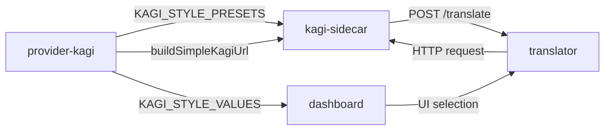
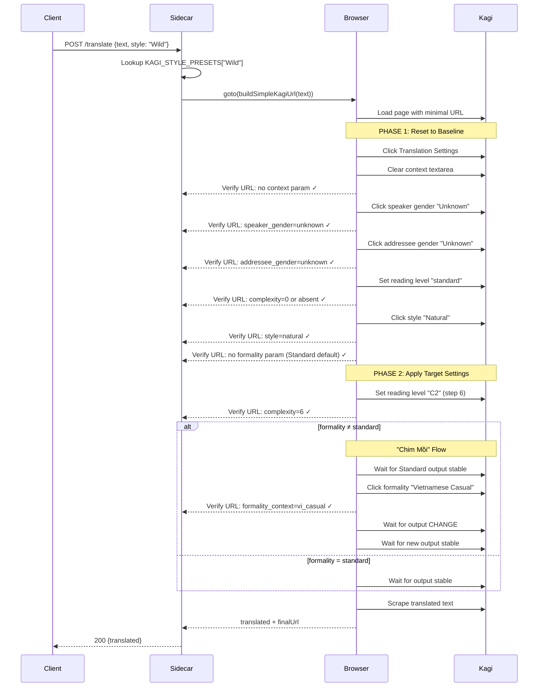

# Kagi UI Interaction Refactor - Design Specification

**Version:** 1.0  
**Date:** 2026-04-10  
**Prepared by:** AI-assisted (User-confirmed design)  
**Status:** Approved - Ready for Implementation

---

## Executive Summary

Refactor Kagi translation provider from URL parameter-based styling (broken) to UI interaction-based styling (verified working). Research in `nghien_cuu_cua_toi` proved that Kagi silently ignores style parameters in URL query strings but correctly applies styles when settings are changed through actual UI interactions (clicking, sliding, typing). This epic ports the verified UI interaction approach from research environment to production packages while maintaining API compatibility.

**Scope:** 3 packages affected - `@chatwork-bot/provider-kagi`, `@chatwork-bot/kagi-sidecar`, `@chatwork-bot/dashboard`

**Impact:** All free room translations via Kagi sidecar. Currently broken styling will be fixed.

**Key Innovation:** Two-phase verification strategy (baseline + target) ensures browser reuse doesn't corrupt state between requests.

---

## Table of Contents

1. [Objective & Scope](#objective--scope)
2. [System Architecture](#system-architecture)
3. [Component Design](#component-design)
4. [Data Model & Types](#data-model--types)
5. [UI Interaction Flow](#ui-interaction-flow)
6. ["Chim Mồi" Technique](#chim-mồi-technique)
7. [Two-Phase Verification Strategy](#two-phase-verification-strategy)
8. [Error Handling & Logging](#error-handling--logging)
9. [Testing Strategy](#testing-strategy)
10. [Dashboard Changes](#dashboard-changes)
11. [Rollout Plan](#rollout-plan)
12. [Risks & Mitigations](#risks--mitigations)
13. [Acceptance Criteria](#acceptance-criteria)
14. [Decision Log](#decision-log)
15. [Out of Scope](#out-of-scope)

---

## Objective & Scope

### Objective

Fix broken Kagi translation styling by replacing URL parameter approach with verified UI interaction approach. Enable reliable translation style application starting with "Wild" style, with clear path to verify and enable remaining 11 styles.

### Scope

**In Scope:**

- Port UI interaction logic from `nghien_cuu_cua_toi` research to production `kagi-sidecar`
- Add `buildSimpleKagiUrl()` to `provider-kagi` for minimal URL generation
- Extend `PageLike` interface to support UI automation methods
- Implement two-phase verification (baseline reset + target application)
- Implement "chim mồi" technique for non-standard formality
- Remove dead polling-based code from sidecar
- Filter dashboard to show only verified "Wild" style
- Add fail-fast error handling (maxRetries: 0 default)
- Write verification checklist doc for future styles
- Port selective core tests from research

**Non-Goals:**

- ❌ Verify all 12 styles immediately (only "Wild" in this epic)
- ❌ Change translator package or buildPreviewUrl (maintain API compatibility)
- ❌ Add retry logic for production (fail-fast for dev/local)
- ❌ Automated E2E testing with real browser (manual testing sufficient)
- ❌ Breaking changes to external API contracts

### Definition of Done

- [x] User can select "Wild" style on dashboard
- [x] Translation request with "Wild" style applies correct settings via UI interaction
- [x] URL address bar reflects all applied settings (verified at each step)
- [x] Two-phase verification catches browser state corruption
- [x] UI interaction failures throw UI_INTERACTION error immediately (fail-fast)
- [x] All tests pass (unit tests for URL builder, UI interaction sequence tests)
- [x] Dashboard shows only "Wild" with clear note about pending styles
- [x] Verification checklist doc exists for enabling future styles
- [x] Dead polling code removed cleanly

### Constraints

- Must maintain API compatibility with existing `buildKagiUrl`/`buildPreviewUrl` usage
- Must work with browser reuse (not fresh launch like research)
- Timing constants from research must be preserved (empirically verified)
- Dev/local environment scope - not production-critical reliability requirements
- Only modify 3 packages: provider-kagi, kagi-sidecar, dashboard

---

## System Architecture

### Current Architecture (Broken)

```
User selects style → buildKagiUrl(text, style, context)
→ URL with params (?formality=vi_casual&language_complexity=6&style=natural)
→ Browser goto(fullUrl)
→ Kagi IGNORES URL params
→ Translation always uses Standard style (default)
→ User receives incorrectly styled output
```

**Root cause:** Kagi translate.kagi.com ignores query parameters for styling. Parameters are cosmetic in URL but don't affect backend translation behavior.

### New Architecture (Verified Working)

```
User selects style → buildSimpleKagiUrl(text)
→ Minimal URL (?from=auto&to=vi&text=...)
→ Browser goto(simpleUrl)
→ Click Translation Settings button
→ PHASE 1: Reset to baseline defaults + verify URL baseline
→ PHASE 2: Apply target settings via UI + verify URL target
→ For non-standard formality: "Chim mồi" technique
→ Scrape translated output with correct style
→ Return result
```

**Why it works:** Kagi's internal state changes only via UI interactions. URL address bar is read-only reflection of internal state - we verify it to ensure interactions succeeded.

### Package Dependency Flow



**Key principle:** `provider-kagi` remains source of truth for style definitions. Sidecar imports presets and URL builder. Dashboard filters styles at schema layer.

---

## Component Design

### Package 1: @chatwork-bot/provider-kagi

**Responsibility:** Provide URL builder utilities and style definitions.

**New Exports:**

```typescript
// New function - minimal URL for UI interaction approach
export function buildSimpleKagiUrl(text: string): string {
  const params = new URLSearchParams({
    from: 'auto',
    to: 'vi',
    text: text
  });
  return `https://translate.kagi.com/?${params.toString()}`;
}

// Existing exports - UNCHANGED
export function buildKagiUrl(text: string, style: KagiStyle, context?: string): string { ... }
export function buildPreviewUrl(style: KagiStyle, context?: string): string { ... }
export { KAGI_STYLE_VALUES, KAGI_STYLE_PRESETS, KAGI_STYLE_LABELS, KAGI_STYLE_DESCRIPTIONS };
```

**Testing:**

```typescript
describe('buildSimpleKagiUrl', () => {
  it('should build minimal URL with from/to/text only', () => {
    const url = buildSimpleKagiUrl('Hello world')
    expect(url).toBe('https://translate.kagi.com/?from=auto&to=vi&text=Hello+world')
  })

  it('should properly encode special characters', () => {
    const url = buildSimpleKagiUrl('Hello & goodbye 你好')
    expect(url).toContain('Hello+%26+goodbye')
  })
})
```

**No changes to:** Types, presets, labels, descriptions, existing URL builders.

---

### Package 2: @chatwork-bot/kagi-sidecar

**Responsibility:** Execute translation via browser automation with UI interaction.

#### Interface Extensions

```typescript
// New interface for element handles returned by waitForSelector
export interface ElementHandleLike {
  click(): Promise<void>
}

// Extended PageLike interface
export interface PageLike {
  // Existing methods
  goto(url: string, options?: any): Promise<any>
  waitForSelector(selector: string, options?: any): Promise<ElementHandleLike | null>
  evaluate<T>(fn: (...args: any[]) => T, ...args: any[]): Promise<T>
  $eval<T>(selector: string, fn: (element: Element) => T): Promise<T>

  // NEW methods for UI interaction
  waitForFunction(
    fn: (...args: any[]) => any,
    options?: { timeout?: number; polling?: number | 'raf' | 'mutation' },
    ...args: any[]
  ): Promise<void>
  click(selector: string): Promise<void>
  focus(selector: string): Promise<void>
  url(): string
}
```

**Rationale:** Maintain mock seam for tests. Each test can verify exact UI interaction sequence with correct arguments.

#### New Constants

**File:** `packages/kagi-sidecar/src/constants/kagi-ui.ts`

```typescript
// CSS Selectors - verified in research
export const KAGI_SELECTORS = {
  TRANSLATION_SETTINGS_BUTTON: '[aria-label="Translation Settings"]',
  CONTEXT_TEXTAREA: 'textarea[placeholder*="context"]',
  READING_LEVEL_SLIDER: 'input[type="range"][aria-label*="reading level"]',
  GENDER_LABEL: 'label span', // Disambiguate by matchIndex
  STYLE_LABEL: 'label span',
  FORMALITY_LABEL: 'label span',
  TRANSLATION_CONTENT: '.translation-content, [class*="translation"]',
} as const

// Timing delays - empirically verified in research
export const KAGI_TIMING = {
  POST_DIALOG_SETTLE_MS: 400,
  STYLE_OPTION_CLICK_GAP_MS: 200,
  POST_FORMALITY_CASUAL_SETTLE_MS: 3000,
  TRANSLATION_OUTPUT_STABLE_MS: 1500,
  TRANSLATION_OUTPUT_POLL_MS: 400,
  TRANSLATION_OUTPUT_MAX_WAIT_MS: 90000,
  POST_STABLE_EXTRA_MS: 250,
} as const

// UI Labels - exact text in Kagi UI
export const KAGI_UI_LABELS = {
  TRANSLATION_STYLE: {
    NATURAL: 'Natural',
    LITERAL: 'Literal',
  },
  FORMALITY: {
    STANDARD: 'Standard',
    VIETNAMESE_CASUAL: 'Vietnamese Casual',
    VIETNAMESE_FORMAL: 'Vietnamese Formal',
  },
  GENDER: {
    UNKNOWN: 'Unknown',
    NEUTRAL: 'Neutral',
    FEMININE: 'Feminine',
    MASCULINE: 'Masculine',
  },
} as const

// Mapping constants
export const READING_LEVEL_TO_STEP: Record<string, number> = {
  standard: 0,
  a1: 1,
  a2: 2,
  b1: 3,
  b2: 4,
  c1: 5,
  c2: 6,
}

export const FORMALITY_TO_URL_PARAM: Record<string, string> = {
  standard: '',
  vietnamese_casual: 'vi_casual',
  vietnamese_formal: 'vi_formal',
}

export const FORMALITY_LABELS: Record<string, string> = {
  standard: 'Standard',
  vietnamese_casual: 'Vietnamese Casual',
  vietnamese_formal: 'Vietnamese Formal',
}
```

#### New UI Interaction Methods

**File:** `packages/kagi-sidecar/src/services/browser-service.ts`

```typescript
export class KagiBrowserService {
  // 10 new private methods - ported from research with fail-fast adaptation

  private async clickTranslationSettingsButton(page: PageLike): Promise<void> {
    // Find and click Translation Settings button
    // Throws UI_INTERACTION if not found or not clickable
  }

  private async clearTranslationContext(page: PageLike): Promise<void> {
    // Focus textarea, clear value, dispatch events
    // Used in baseline reset phase
  }

  private async fillTranslationContext(page: PageLike, context: string): Promise<void> {
    // Focus textarea, set value, dispatch events
    // Used in target application phase if context provided
  }

  private async clickSpeakerGenderOption(page: PageLike, label: string): Promise<void> {
    // Click speaker gender label (matchIndex=0)
    // Throws UI_INTERACTION if label not found
  }

  private async clickAddresseeGenderOption(page: PageLike, label: string): Promise<void> {
    // Click addressee gender label (matchIndex=1)
    // Throws UI_INTERACTION if label not found
  }

  private async setReadingLevel(page: PageLike, level: string): Promise<void> {
    // Set slider to target step, dispatch input/change events
    // Throws UI_INTERACTION if slider not visible
  }

  private async clickTranslationStyleOption(page: PageLike, label: string): Promise<void> {
    // Click Natural/Literal label
    // Throws UI_INTERACTION if label not found
  }

  private async clickFormalityOption(page: PageLike, label: string): Promise<void> {
    // Click formality label with root-finding disambiguation
    // Throws UI_INTERACTION if label not found or click fails
  }

  private async waitForFormalityUrlUpdate(page: PageLike, fragment: string): Promise<void> {
    // Wait for URL address bar to contain expected fragment
    // Throws UI_INTERACTION if timeout (3s default)
  }

  private async waitForTranslationOutputStable(page: PageLike): Promise<void> {
    // Poll .translation-content until text stops changing for 1.5s
    // Throws UI_INTERACTION if not stable within 90s
  }

  private async waitForTranslationContentChange(page: PageLike, beforeText: string): Promise<void> {
    // Detect output changed after formality switch
    // Throws UI_INTERACTION if text doesn't change within 90s
  }
}
```

#### Configuration Changes

```typescript
// Constructor default change
export class KagiBrowserService {
  constructor(options: KagiBrowserServiceOptions = {}) {
    // BEFORE: this.maxRetries = options.maxRetries ?? 2;
    // AFTER:
    this.maxRetries = options.maxRetries ?? 0 // Fail-fast by default
  }
}
```

#### Error Code Addition

```typescript
// Add to union type
type KagiSidecarErrorCode =
  | 'TIMEOUT'
  | 'NAVIGATION_FAILED'
  | 'ANTI_ABUSE_DETECTED'
  | 'UI_INTERACTION' // NEW - retryable: false
```

#### Dead Code Removal

**Remove completely:**

- Method: `waitForStableTranslatedText()`
- Method: `readTranslationText()`
- Method: `readVisiblePageText()`
- Method: `detectAntiAbuse()`
- Method: `ensureTranslatedContent()`
- Constant: `TRANSLATION_STABILITY_POLL_MS`
- Constant: `REQUIRED_STABLE_SAMPLES`

**Rationale:** New approach uses `waitForFunction`-based polling (more accurate). Old polling code no longer used.

---

### Package 3: @chatwork-bot/dashboard

**Responsibility:** Filter Kagi style options to verified styles only.

**File:** `packages/dashboard/src/lib/free-room-schemas.ts`

```typescript
import { KAGI_STYLE_VALUES, type KagiStyle } from '@chatwork-bot/provider-kagi'

/**
 * ACTIVE_KAGI_STYLES - Styles verified and enabled for dashboard
 *
 * Currently only "Wild" has been manually verified with UI interaction approach.
 * To enable additional styles:
 * 1. Follow verification checklist in docs/kagi-style-verification.md
 * 2. Test in nghien_cuu_cua_toi environment
 * 3. Verify "chim mồi" requirements for each formality
 * 4. Add verified style to this array
 * 5. Update labels and descriptions below
 */
const ACTIVE_KAGI_STYLES = ['Wild'] as const satisfies readonly KagiStyle[]

export const FREE_ROOM_KAGI_STYLES = ACTIVE_KAGI_STYLES

export const FREE_ROOM_KAGI_STYLE_LABELS = {
  Wild: 'Wild',
} as const

export const FREE_ROOM_KAGI_STYLE_DESCRIPTIONS = {
  Wild: 'Casual, vivid, and full of energy.',
} as const

export const freeRoomKagiStyleSchema = z.enum(FREE_ROOM_KAGI_STYLES)
```

**Form default change:**

```typescript
// packages/dashboard/src/pages/free-room-create.tsx
const defaultValues = {
  kagiStyle: 'Wild' as const, // Changed from 'Clear'
  // ...
}
```

**UI note:**

```tsx
<div className="note">
  ℹ️ Các styles khác (Warm, Easy, Clear, Bright, Smooth, Calm, Rich, Crisp, Gentle, Bold, Fresh)
  đang được verify và sẽ được mở lại khi sẵn sàng. Hiện tại chỉ "Wild" đã được test và xác nhận hoạt
  động đúng.
</div>
```

---

## Data Model & Types

### No Database Changes

Project has no database. Data model changes limited to TypeScript types and constants.

### Type Changes

**Provider-Kagi:**

- ✅ No type changes
- ➕ New export: `buildSimpleKagiUrl`

**Kagi-Sidecar:**

- ➕ New interface: `ElementHandleLike`
- 🔧 Extended interface: `PageLike` (+4 methods)
- ➕ New error code: `'UI_INTERACTION'`
- ✅ No changes to: `KagiTranslateRequest`, `KagiTranslationResult`, `KagiBrowserServiceOptions`

**Dashboard:**

- 🔧 Changed const: `ACTIVE_KAGI_STYLES` from 12 → 1 item
- 🔧 Filtered: `FREE_ROOM_KAGI_STYLE_LABELS`, `FREE_ROOM_KAGI_STYLE_DESCRIPTIONS`
- ✅ Zod schema automatically validates only active styles

---

## UI Interaction Flow

### High-Level Sequence



### Detailed 14-Step executeTranslation Flow

```typescript
async executeTranslation(request: KagiTranslateRequest): Promise<KagiTranslationResult> {
  const preset = KAGI_STYLE_PRESETS[request.style];
  const simpleUrl = buildSimpleKagiUrl(request.text);

  // 1. Navigate to simple URL
  await page.goto(simpleUrl);

  // 2. Open Translation Settings dialog
  await clickTranslationSettingsButton(page);
  await delay(POST_DIALOG_SETTLE_MS); // 400ms

  // ═════════════════════════════════════════════════════════
  // PHASE 1: RESET TO BASELINE (Defaults) + VERIFY
  // ═════════════════════════════════════════════════════════

  // 3. Clear context textarea
  await clearTranslationContext(page);
  await delay(STYLE_OPTION_CLICK_GAP_MS);
  await verifyUrlNotContains(page, 'context=', 'Context should be cleared');

  // 4. Click speaker gender "Unknown" (default)
  await clickSpeakerGenderOption(page, 'Unknown');
  await delay(STYLE_OPTION_CLICK_GAP_MS);
  await verifyUrlContains(page, 'speaker_gender=unknown', 'Speaker gender baseline');

  // 5. Click addressee gender "Unknown" (default)
  await clickAddresseeGenderOption(page, 'Unknown');
  await delay(STYLE_OPTION_CLICK_GAP_MS);
  await verifyUrlContains(page, 'addressee_gender=unknown', 'Addressee gender baseline');

  // 6. Set reading level "standard" (default)
  await setReadingLevel(page, 'standard');
  await delay(STYLE_OPTION_CLICK_GAP_MS);
  await verifyUrlMatchesReadingLevel(page, 'standard', 'Reading level baseline');

  // 7. Click translation style "Natural" (default)
  await clickTranslationStyleOption(page, 'Natural');
  await delay(STYLE_OPTION_CLICK_GAP_MS);
  await verifyUrlContains(page, 'style=natural', 'Translation style baseline');

  // 8. Verify formality "Standard" (implicit default, no param)
  await verifyUrlNotContains(page, 'formality_context=', 'Formality baseline (Standard)');

  console.log('[BASELINE VERIFIED]', page.url());

  // ═════════════════════════════════════════════════════════
  // PHASE 2: APPLY TARGET SETTINGS + VERIFY
  // ═════════════════════════════════════════════════════════

  // 9. Fill context if provided
  if (request.context) {
    await fillTranslationContext(page, request.context);
    await delay(STYLE_OPTION_CLICK_GAP_MS);
    await verifyUrlContains(page, 'context=', 'Context target');
  }

  // 10. Set target reading level if different from standard
  if (preset.readingLevel !== 'standard') {
    await setReadingLevel(page, preset.readingLevel); // e.g., 'c2'
    await delay(STYLE_OPTION_CLICK_GAP_MS);
    await verifyUrlMatchesReadingLevel(page, preset.readingLevel, 'Reading level target');
  }

  // 11. Set target translation style if different from natural
  if (preset.translationType !== 'natural') {
    await clickTranslationStyleOption(page, 'Literal');
    await delay(STYLE_OPTION_CLICK_GAP_MS);
    await verifyUrlContains(page, 'style=literal', 'Translation style target');
  }

  // 12. Handle formality with "Chim mồi" if non-standard
  if (preset.formality !== 'standard') {
    // 12a. Wait for Standard output stable
    await waitForTranslationOutputStable(page);
    const standardOutput = await scrapeTranslatedText(page);

    // 12b. Click target formality
    const formalityLabel = FORMALITY_LABELS[preset.formality];
    await clickFormalityOption(page, formalityLabel);

    // 12c. Verify URL updated
    const expectedParam = FORMALITY_TO_URL_PARAM[preset.formality];
    await waitForFormalityUrlUpdate(page, `formality_context=${expectedParam}`);

    // 12d. Wait for output CHANGE
    await waitForTranslationContentChange(page, standardOutput);

    // 12e. Wait for new output stable
    await waitForTranslationOutputStable(page);
  } else {
    // Standard formality - just wait for output
    await waitForTranslationOutputStable(page);
  }

  // 13. Log final URL
  const finalUrl = page.url();
  console.log('[TARGET VERIFIED]', finalUrl);

  // 14. Scrape and return
  const translated = await scrapeTranslatedText(page);
  return { translated, attempts: 1, queueWaitMs, transportLatencyMs };
}
```

---

## "Chim Mồi" Technique

### Problem Statement

When setting formality to "Vietnamese Casual" or "Vietnamese Formal" directly, Kagi's UI does not properly apply the formality setting. The URL address bar doesn't reflect the `formality_context` parameter, and the translation output remains in Standard formality.

### Root Cause (Hypothesis)

Kagi's frontend has a race condition or state initialization issue where formality changes only take effect if a previous translation with Standard formality has completed first. Setting formality at initial page load or immediately after other settings doesn't trigger the backend to acknowledge the formality preference.

### Solution: "Chim Mồi" (Decoy) Technique

**Vietnamese term:** "Chim mồi" = decoy bird (hunting term - use fake bird to attract real birds)

**Strategy:** First let Kagi translate with Standard formality (default), wait for output to complete and stabilize, THEN switch to target formality and wait for new output.

### Implementation

```typescript
if (preset.formality !== 'standard') {
  // Step 1: Let Standard formality translation complete
  console.log('[CHIM MỒI] Waiting for Standard output first...')
  await waitForTranslationOutputStable(page)
  const standardOutput = await scrapeTranslatedText(page)

  // Step 2: Now switch to target formality
  console.log(`[CHIM MỒI] Switching to ${preset.formality}...`)
  await clickFormalityOption(page, FORMALITY_LABELS[preset.formality])

  // Step 3: Verify URL updated with formality param
  const expectedParam = FORMALITY_TO_URL_PARAM[preset.formality]
  await waitForFormalityUrlUpdate(page, `formality_context=${expectedParam}`)

  // Step 4: Verify output CHANGED from Standard
  console.log('[CHIM MỒI] Waiting for output to change...')
  await waitForTranslationContentChange(page, standardOutput)

  // Step 5: Wait for new output to stabilize
  console.log('[CHIM MỒI] Waiting for new output to stabilize...')
  await waitForTranslationOutputStable(page)

  console.log('[CHIM MỒI] Complete - formality applied correctly')
}
```

### When to Apply

- ✅ **Apply "chim mồi":** When `preset.formality === 'vietnamese_casual'` OR `preset.formality === 'vietnamese_formal'`
- ❌ **Skip "chim mồi":** When `preset.formality === 'standard'` (already default, no switch needed)

### Verification Points

1. **Before switch:** URL has no `formality_context` param (Standard default)
2. **After switch:** URL contains `formality_context=vi_casual` or `formality_context=vi_formal`
3. **Output change:** Translated text differs from Standard output (tone, formality markers visible)
4. **Output stable:** New output doesn't change for 1.5+ seconds

### Risk Mitigation

If Kagi fixes their formality bug in the future, our "chim mồi" technique becomes unnecessary but harmless:

- Standard output appears → ignored
- Switch to target formality → applies correctly (whether or not chim mồi needed)
- URL verification will still pass
- Output will still be correct

To remove workaround later: just delete the `if (preset.formality !== 'standard')` branch and directly click target formality.

---

## Two-Phase Verification Strategy

### Motivation

**Problem:** Sidecar reuses browser across requests (unlike research which launches fresh browser). Previous request's settings might "leak" into current request if state reset fails.

**Example failure scenario without verification:**

1. Request A sets reading level C2, formality Vietnamese Casual
2. Request B intends Standard/Standard, but browser still has C2/Casual sticky
3. Request B gets wrong output (C2/Casual instead of Standard/Standard)
4. Bug only discovered when comparing outputs manually

**Solution:** Two-phase verification with URL address bar as source of truth.

### Phase 1: Baseline Reset Verification

**Goal:** Ensure ALL settings are explicitly reset to defaults BEFORE applying target settings.

**Why:** Catch browser state corruption early. If baseline verification fails, we know immediately that previous request left residue, not that target application failed.

**Steps:**

```typescript
// Clear context
await clearTranslationContext(page)
await verifyUrlNotContains(page, 'context=', 'Baseline: context cleared') // ✓ No param

// Reset genders to Unknown (default)
await clickSpeakerGenderOption(page, 'Unknown')
await verifyUrlContains(page, 'speaker_gender=unknown', 'Baseline: speaker gender') // ✓ Has default param

await clickAddresseeGenderOption(page, 'Unknown')
await verifyUrlContains(page, 'addressee_gender=unknown', 'Baseline: addressee gender') // ✓ Has default param

// Reset reading level to Standard (default)
await setReadingLevel(page, 'standard')
await verifyUrlMatchesReadingLevel(page, 'standard', 'Baseline: reading level') // ✓ complexity=0 or absent

// Reset translation style to Natural (default)
await clickTranslationStyleOption(page, 'Natural')
await verifyUrlContains(page, 'style=natural', 'Baseline: translation style') // ✓ Has default param

// Verify formality is Standard (default, no param)
await verifyUrlNotContains(page, 'formality_context=', 'Baseline: formality standard') // ✓ No param
```

**Baseline success criteria:** All verification gates pass → clean slate confirmed.

**Baseline failure:** Any verification gate fails → throw UI_INTERACTION with context showing which baseline setting failed to reset → indicates browser corruption.

### Phase 2: Target Application Verification

**Goal:** Apply target settings and verify URL reflects EVERY change.

**Why:** Ensure UI interactions actually changed Kagi's internal state, not just cosmetic UI updates.

**Steps:**

```typescript
// Apply context if provided
if (request.context) {
  await fillTranslationContext(page, request.context)
  await verifyUrlContains(page, 'context=', 'Target: context') // ✓ Param present
}

// Apply target reading level if non-default
if (preset.readingLevel !== 'standard') {
  await setReadingLevel(page, preset.readingLevel) // e.g., 'c2'
  await verifyUrlMatchesReadingLevel(page, preset.readingLevel, 'Target: reading level') // ✓ complexity=6
}

// Apply target translation style if non-default
if (preset.translationType !== 'natural') {
  await clickTranslationStyleOption(page, 'Literal')
  await verifyUrlContains(page, 'style=literal', 'Target: translation style') // ✓ Param changed
}

// Apply target formality with chim mồi if non-default
if (preset.formality !== 'standard') {
  // ... chim mồi flow with URL verification ...
  await waitForFormalityUrlUpdate(page, `formality_context=${expectedParam}`) // ✓ Param present
}
```

**Target success criteria:** All verification gates pass → target settings applied correctly.

**Target failure:** Any verification gate fails → throw UI_INTERACTION with context showing which target setting failed to apply → indicates UI interaction didn't work.

### Verification Helper Methods

```typescript
// Verify URL CONTAINS expected fragment
private async verifyUrlContains(
  page: PageLike,
  expectedFragment: string,
  errorContext: string
): Promise<void> {
  const currentUrl = page.url();
  if (!currentUrl.includes(expectedFragment)) {
    console.error('[UI_INTERACTION] URL verification failed', {
      expectedFragment,
      actualUrl: currentUrl,
      context: errorContext,
      phase: 'contains-check'
    });
    throw new Error(
      `[UI_INTERACTION] ${errorContext}. Expected URL to contain "${expectedFragment}", got: ${currentUrl}`
    );
  }
}

// Verify URL does NOT contain fragment
private async verifyUrlNotContains(
  page: PageLike,
  forbiddenFragment: string,
  errorContext: string
): Promise<void> {
  const currentUrl = page.url();
  if (currentUrl.includes(forbiddenFragment)) {
    console.error('[UI_INTERACTION] URL verification failed', {
      forbiddenFragment,
      actualUrl: currentUrl,
      context: errorContext,
      phase: 'not-contains-check'
    });
    throw new Error(
      `[UI_INTERACTION] ${errorContext}. Expected URL NOT to contain "${forbiddenFragment}", got: ${currentUrl}`
    );
  }
}

// Verify reading level matches (handles both present and absent params)
private async verifyUrlMatchesReadingLevel(
  page: PageLike,
  level: string,
  errorContext: string
): Promise<void> {
  const currentUrl = page.url();
  const expectedStep = READING_LEVEL_TO_STEP[level];

  if (level === 'standard') {
    // Standard can be absent or =0
    const hasParam = currentUrl.includes('language_complexity=');
    if (hasParam && !currentUrl.includes('language_complexity=0')) {
      throw new Error(`[UI_INTERACTION] ${errorContext}. Expected standard, got: ${currentUrl}`);
    }
  } else {
    // Non-standard must have explicit param
    if (!currentUrl.includes(`language_complexity=${expectedStep}`)) {
      throw new Error(`[UI_INTERACTION] ${errorContext}. Expected step ${expectedStep}, got: ${currentUrl}`);
    }
  }
}
```

### Benefits Summary

✅ **Early failure detection:** Baseline phase catches browser corruption before wasting time on target application

✅ **Clear error attribution:** Failure in baseline vs target phase pinpoints root cause

✅ **Explicit state management:** No assumptions about browser defaults - always reset explicitly

✅ **URL as source of truth:** Address bar reflects Kagi's internal state - we verify it at every step

✅ **Fail-fast philosophy:** Any discrepancy → immediate error with rich context for debugging

---

## Error Handling & Logging

### Error Code Addition

```typescript
type KagiSidecarErrorCode =
  | 'TIMEOUT'
  | 'NAVIGATION_FAILED'
  | 'ANTI_ABUSE_DETECTED'
  | 'UI_INTERACTION' // NEW

interface KagiSidecarError extends Error {
  code: KagiSidecarErrorCode
  retryable: boolean
  context?: Record<string, any>
}
```

**UI_INTERACTION Error Properties:**

- `code: 'UI_INTERACTION'`
- `retryable: false` - Fail-fast, no automatic retry
- `context`: Step name, CSS selector, timeout, actual URL, expected fragment, error message

### Fail-Fast Strategy

**Philosophy:** In dev/local environment, immediate failure visibility > masked failures + silent degradation.

**Implementation:**

- Each UI interaction step failure → log rich context → throw immediately
- No retry loop (maxRetries: 0 by default)
- HTTP 502 Bad Gateway response with error code + message
- Developer reads docker logs / terminal to see exact step + context

**Rationale:**

- UI interaction failures are NOT transient (unlike network blips)
- Each failure signals a real issue needing investigation (selector changed, Kagi UI redesign, timing too aggressive)
- Retry would waste time and obscure root cause
- Production can override `maxRetries` via config if needed, but dev benefits from fail-fast

### Logging Format (Hybrid Approach)

**Decision:** Hybrid logging - human-readable prefix + structured JSON fields

**Format:**

```typescript
console.error('[UI_INTERACTION] Step failed: Click speaker gender', {
  step: 'clickSpeakerGenderOption',
  selector: KAGI_SELECTORS.GENDER_LABEL,
  matchIndex: 0,
  timeout: 30000,
  actualUrl: page.url(),
  expectedLabel: 'Unknown',
  error: error.message,
  timestamp: new Date().toISOString(),
  phase: 'baseline-reset', // or 'target-application'
})
```

**Benefits:**

- Human-readable when streaming docker logs (`docker logs -f kagi-sidecar`)
- Structured fields allow parsing/filtering if needed (e.g., aggregate error types)
- Balance between dev UX (easy to read) and operational needs (easy to parse)

### HTTP Response Mapping

```typescript
// HTTP status codes by error type
const ERROR_HTTP_STATUS: Record<KagiSidecarErrorCode, number> = {
  TIMEOUT: 504, // Gateway Timeout
  NAVIGATION_FAILED: 502, // Bad Gateway
  ANTI_ABUSE_DETECTED: 429, // Too Many Requests
  UI_INTERACTION: 502, // Bad Gateway (external service issue)
}
```

**Error response body:**

```json
{
  "error": {
    "code": "UI_INTERACTION",
    "message": "URL verification failed: Context param missing after fill. Expected URL to contain \"context=\", got: https://translate.kagi.com/?from=auto&to=vi&text=hello",
    "context": {
      "step": "fillTranslationContext",
      "phase": "target-application",
      "timestamp": "2026-04-10T09:30:45.123Z"
    }
  }
}
```

---

## Testing Strategy

### Test Categories

| Category                    | What to Test                                       | Coverage                                |
| --------------------------- | -------------------------------------------------- | --------------------------------------- |
| **URL Builder**             | `buildSimpleKagiUrl` generates correct minimal URL | Unit tests - 100%                       |
| **UI Interaction Sequence** | Correct method call order, correct args            | Unit tests with mocks - Core flows      |
| **Two-Phase Verification**  | Baseline gates pass, then target gates pass        | Unit tests with mocks - New             |
| **"Chim Mồi" Flow**         | Triggers only when formality ≠ standard            | Unit tests with mocks - Formality flows |
| **Fail-Fast Behavior**      | Each step failure throws UI_INTERACTION            | Unit tests with mocks - Error cases     |
| **PageLike Mock**           | Mock verifies exact calls with exact args          | All sidecar tests - Foundation          |

### Port from Research (Selective)

**Tests TO port:**

- `url-builder.service.test.ts` - Selective tests for simple URL builder
- `browser.service.test.ts` - Core UI interaction sequence tests
- `browser.service.test.ts` - Formality flow tests ("chim mồi")
- `browser.service.test.ts` - Error handling tests (fail-fast)

**Tests NOT to port:**

- `translation.e2e.test.ts` - E2E with real browser (too slow, manual testing sufficient)
- `reading-level-sweep.service.test.ts` - Experimental sweep tests
- Config exploratory tests - Not needed in production

### Mock Pattern Example

```typescript
describe('KagiBrowserService - Two-Phase Verification', () => {
  it('should verify baseline defaults before applying target settings', async () => {
    const mockPage: PageLike = {
      goto: jest.fn().mockResolvedValue(undefined),
      waitForSelector: jest.fn().mockResolvedValue({ click: jest.fn() }),
      click: jest.fn().mockResolvedValue(undefined),
      focus: jest.fn().mockResolvedValue(undefined),
      url: jest
        .fn()
        .mockReturnValueOnce('...?speaker_gender=unknown') // after baseline speaker
        .mockReturnValueOnce('...?addressee_gender=unknown') // after baseline addressee
        .mockReturnValueOnce('...?style=natural') // after baseline style
        .mockReturnValueOnce('...?language_complexity=6') // after target C2
        .mockReturnValueOnce('...?formality_context=vi_casual'), // after target casual
      waitForFunction: jest.fn().mockResolvedValue(undefined),
      evaluate: jest
        .fn()
        .mockResolvedValueOnce('Standard output text') // first scrape
        .mockResolvedValueOnce('Casual output text'), // after formality switch
      $eval: jest.fn().mockResolvedValue('translated text'),
    }

    const service = new KagiBrowserService({ maxRetries: 0 })

    await service.executeTranslation({
      text: 'hello',
      style: 'Wild',
      context: undefined,
    })

    // Verify baseline phase
    const calls = mockPage.url.mock.calls
    expect(calls[0][0]).toContain('speaker_gender=unknown') // baseline verified
    expect(calls[1][0]).toContain('addressee_gender=unknown') // baseline verified

    // Verify target phase
    expect(calls[3][0]).toContain('language_complexity=6') // target C2 applied
    expect(calls[4][0]).toContain('formality_context=vi_casual') // target casual applied

    // Verify chim mồi flow triggered
    expect(mockPage.evaluate).toHaveBeenCalledTimes(2) // scrape twice: Standard + Casual
  })

  it('should throw UI_INTERACTION if baseline verification fails', async () => {
    const mockPage: PageLike = {
      goto: jest.fn().mockResolvedValue(undefined),
      waitForSelector: jest.fn().mockResolvedValue({ click: jest.fn() }),
      click: jest.fn().mockResolvedValue(undefined),
      focus: jest.fn().mockResolvedValue(undefined),
      url: jest.fn().mockReturnValueOnce('...?speaker_gender=masculine'), // WRONG - should be unknown
      waitForFunction: jest.fn().mockResolvedValue(undefined),
      evaluate: jest.fn(),
      $eval: jest.fn(),
    }

    const service = new KagiBrowserService({ maxRetries: 0 })

    await expect(service.executeTranslation({ text: 'hello', style: 'Wild' })).rejects.toThrow(
      'Speaker gender not reset to default',
    )
  })
})
```

### Test Coverage Goals

- URL builder: 100% line coverage
- UI interaction methods: 90%+ line coverage
- Core flow (baseline + target + chim mồi): 100% branch coverage
- Error paths (UI_INTERACTION throw): 100% coverage

---

## Dashboard Changes

### Filtering Strategy

**Approach:** Filter at schema layer using `ACTIVE_KAGI_STYLES` constant.

**Why:** Single source of truth. Adding verified styles later = update one array + labels/descriptions.

### Code Changes

**File:** `packages/dashboard/src/lib/free-room-schemas.ts`

```typescript
import { KAGI_STYLE_VALUES, type KagiStyle } from '@chatwork-bot/provider-kagi'

const ACTIVE_KAGI_STYLES = ['Wild'] as const satisfies readonly KagiStyle[]

export const FREE_ROOM_KAGI_STYLES = ACTIVE_KAGI_STYLES

export const FREE_ROOM_KAGI_STYLE_LABELS = {
  Wild: 'Wild',
} as const

export const FREE_ROOM_KAGI_STYLE_DESCRIPTIONS = {
  Wild: 'Casual, vivid, and full of energy.',
} as const

export const freeRoomKagiStyleSchema = z.enum(FREE_ROOM_KAGI_STYLES)
```

**File:** `packages/dashboard/src/pages/free-room-create.tsx`

```typescript
const defaultValues = {
  kagiStyle: 'Wild' as const, // Changed from 'Clear'
  // ...
}
```

**UI Note:**

```tsx
<div className="note">
  ℹ️ Các styles khác (Warm, Easy, Clear, Bright, Smooth, Calm, Rich, Crisp, Gentle, Bold, Fresh)
  đang được verify và sẽ được mở lại khi sẵn sàng. Hiện tại chỉ "Wild" đã được test và xác nhận hoạt
  động đúng.
</div>
```

### Backward Compatibility

**Impact:** Existing rooms with `kagiStyle !== 'Wild'` will show validation errors on dashboard.

**Mitigation:**

1. File `data/free-room-configs.json` already uses "Wild" → minimal real-world impact
2. Default value changed to "Wild" in create form
3. Users must manually edit old rooms if any use non-Wild styles

**Trade-off:** Accept manual editing burden vs complexity of auto-migration script. Simple approach fits dev/local scope.

---

## Rollout Plan

### Phased Incremental Approach

**Phase 1: provider-kagi** (Estimated: 2 hours)

- [ ] Add `buildSimpleKagiUrl(text: string): string` to `url-builder.ts`
- [ ] Write unit tests for simple URL builder
- [ ] Export `buildSimpleKagiUrl` from `index.ts`
- [ ] Run tests: `bun test`
- [ ] Verify all tests pass
- [ ] Commit: `feat(provider-kagi): add buildSimpleKagiUrl for UI interaction approach`

**Phase 2: kagi-sidecar** (Estimated: 3-4 hours)

- [ ] Extend `PageLike` interface (+4 methods)
- [ ] Add `ElementHandleLike` interface
- [ ] Create `constants/kagi-ui.ts` with selectors, timing, labels, mappings
- [ ] Implement 10 UI interaction methods (port from research with fail-fast)
- [ ] Rewrite `executeTranslation` with two-phase verification + chim mồi
- [ ] Add `UI_INTERACTION` error code to types
- [ ] Change constructor default `maxRetries: 2` → `0`
- [ ] Remove dead code: `waitForStableTranslatedText` + 5 utilities + 2 constants
- [ ] Port selective tests from research
- [ ] Run tests: `bun test`
- [ ] Manual smoke test: `bun run docker:dev` → send translation request → verify logs
- [ ] Commit: `feat(kagi-sidecar): implement UI interaction approach with two-phase verification`

**Phase 3: dashboard** (Estimated: 1 hour)

- [ ] Edit `free-room-schemas.ts`: filter `ACTIVE_KAGI_STYLES` to `['Wild']`
- [ ] Update `FREE_ROOM_KAGI_STYLE_LABELS` and `FREE_ROOM_KAGI_STYLE_DESCRIPTIONS`
- [ ] Change default `kagiStyle` in create form to `'Wild'`
- [ ] Add UI note about pending styles
- [ ] Test create new room flow (select Wild, save, verify)
- [ ] Test edit existing room flow (open, change style, save, verify)
- [ ] Verify validation prevents selecting non-Wild styles
- [ ] Commit: `feat(dashboard): limit Kagi styles to verified "Wild" only`

**Phase 4: documentation** (Estimated: 30 minutes)

- [ ] Write `docs/kagi-style-verification.md` checklist
- [ ] Include: prerequisites, verification steps (9-step checklist), verification log table
- [ ] Update any existing docs mentioning Kagi styles (if any)
- [ ] Commit: `docs: add Kagi style verification checklist`

**Total Estimated Timeline:** 6.5-7.5 hours

### Success Criteria

Each phase complete when:

- ✅ All code changes implemented
- ✅ All tests pass (if applicable)
- ✅ Manual testing/verification done (if applicable)
- ✅ Committed to git with clear message

Overall success when:

- ✅ All 4 phases complete
- ✅ Manual end-to-end test: Create free room with "Wild" style → send translation request → verify output has correct style (casual tone, vivid, energetic)
- ✅ Verification checklist doc exists and is usable for testing next style

---

## Risks & Mitigations

### High-Priority Risks

| Risk                                | Impact                                     | Likelihood                        | Mitigation                                                                                     | Residual Risk            |
| ----------------------------------- | ------------------------------------------ | --------------------------------- | ---------------------------------------------------------------------------------------------- | ------------------------ |
| **Browser automation fragility**    | HIGH - Kagi UI changes break selectors     | MEDIUM - UI redesigns happen      | Use semantic selectors (aria-label), fail-fast alerts immediately, document selector rationale | MEDIUM - Need monitoring |
| **Browser reuse state corruption**  | HIGH - Previous request leaks settings     | MEDIUM - Complex state management | Two-phase verification catches baseline corruption early, explicit reset all settings          | LOW - Mitigated          |
| **"Chim mồi" quirk changes**        | MEDIUM - Kagi fixes bug, workaround breaks | LOW - Quirk may be intentional    | URL verification catches mismatch, easy to remove workaround, document quirk clearly           | LOW                      |
| **Timing constants too aggressive** | MEDIUM - Fast machines pass, slow CI fails | MEDIUM - Environment variability  | Conservative defaults (90s max timeout), tunable via config, documented why each timing        | LOW                      |

### Medium-Priority Risks

| Risk                              | Impact                                     | Mitigation                                                                              | Residual Risk |
| --------------------------------- | ------------------------------------------ | --------------------------------------------------------------------------------------- | ------------- |
| **Only 1 style available**        | LOW - Users expect more options            | Clear UI communication, verification checklist for adding more                          | ACCEPT        |
| **No retry on UI failures**       | MEDIUM - Transient issues cause failures   | Fail-fast prioritizes debuggability (dev/local context), production can configure retry | ACCEPT        |
| **Port test coverage gaps**       | MEDIUM - Bugs not caught                   | Port selective core tests, manual E2E for critical flows                                | LOW           |
| **Dashboard validation breakage** | LOW - Existing rooms with old styles error | Data already uses "Wild", clear error message, manual edit required                     | ACCEPT        |

### Monitoring Recommendations

**Post-deployment:**

1. Track `UI_INTERACTION` error rates in logs
2. Set up alert if error rate > 10% of translation requests
3. Weekly review of error logs to catch selector breakage early
4. Monitor Kagi UI changes (subscribe to changelog if available)

---

## Acceptance Criteria

### Functional Requirements

- [ ] User can create free room with "Wild" style on dashboard
- [ ] User can edit existing free room and select "Wild" style
- [ ] Dashboard dropdown shows only "Wild" with description "Casual, vivid, and full of energy."
- [ ] Dashboard shows clear note about other 11 styles pending verification
- [ ] Translation request with `{ text: "Hello, how are you?", style: "Wild" }` returns casual/vivid Vietnamese output
- [ ] URL address bar after translation reflects all applied settings:
  - `speaker_gender=unknown`
  - `addressee_gender=unknown`
  - `language_complexity=6` (C2)
  - `style=natural`
  - `formality_context=vi_casual`
- [ ] Baseline verification gates pass for every request (clean state confirmed)
- [ ] Target verification gates pass for every request (settings applied correctly)
- [ ] "Chim mồi" flow executes for Wild style (Vietnamese Casual formality):
  - Standard output appears first
  - Formality switches to Casual
  - URL updates with `formality_context=vi_casual`
  - Output changes from Standard to Casual tone
  - New output stabilizes

### Non-Functional Requirements

- [ ] UI interaction failure throws `UI_INTERACTION` error immediately (no retry)
- [ ] Error includes rich context: step name, selector, timeout, URL, expected fragment
- [ ] Error logged in hybrid format: `[UI_INTERACTION] <message>` + JSON fields
- [ ] HTTP 502 response returned on UI interaction failure
- [ ] All unit tests pass: `bun test`
- [ ] No linter errors: `bun run lint`
- [ ] TypeScript compiles: `bun run typecheck`
- [ ] Dead code removed: `waitForStableTranslatedText` + 5 utilities + 2 constants

### Documentation Requirements

- [ ] `docs/kagi-style-verification.md` checklist exists
- [ ] Checklist includes 9-step verification process
- [ ] Checklist includes verification log table (12 styles, status tracking)
- [ ] Checklist documents "chim mồi" technique and when to apply
- [ ] Code comments explain two-phase verification strategy
- [ ] Code comments explain URL verification gates and why needed

### Testing Requirements

- [ ] `buildSimpleKagiUrl` has unit tests with 100% coverage
- [ ] UI interaction sequence tests verify correct method call order
- [ ] Two-phase verification tests verify baseline gates → target gates
- [ ] "Chim mồi" flow tests verify Standard → Casual → output change
- [ ] Fail-fast tests verify each step failure throws UI_INTERACTION
- [ ] Mock pattern tests verify exact arguments passed to page methods

---

## Happy Path

**Scenario:** User creates free room with "Wild" style and sends translation request.

1. User opens dashboard → "New Free Room" page
2. User fills room ID, source room name, destination room name
3. User sees "Provider" dropdown disabled, showing "Translate Free"
4. User sees "Translation Style" dropdown with single option: "Wild"
5. User sees description: "Casual, vivid, and full of energy."
6. User sees note: "Other styles pending verification..."
7. User optionally fills translation context (max 100 chars)
8. User clicks "Create Room" → success toast → redirected to rooms list
9. New free room appears with "Wild" badge
10. Chatwork message arrives in source room: "Hello, how are you?"
11. Translator package sends request to kagi-sidecar: `POST /translate { text: "Hello, how are you?", style: "Wild" }`
12. Sidecar navigates to simple URL: `https://translate.kagi.com/?from=auto&to=vi&text=Hello%2C+how+are+you%3F`
13. Sidecar opens Translation Settings dialog
14. **PHASE 1 (Baseline):** Sidecar resets all settings to defaults, verifies URL after each:
    - Clear context → URL has no `context=` param ✓
    - Click speaker gender "Unknown" → URL has `speaker_gender=unknown` ✓
    - Click addressee gender "Unknown" → URL has `addressee_gender=unknown` ✓
    - Set reading level "standard" → URL has `language_complexity=0` or absent ✓
    - Click style "Natural" → URL has `style=natural` ✓
    - Verify formality "Standard" → URL has no `formality_context=` param ✓
15. Sidecar logs: `[BASELINE VERIFIED] All settings reset to defaults`
16. **PHASE 2 (Target):** Sidecar applies Wild style settings, verifies URL after each:
    - Set reading level "C2" → URL has `language_complexity=6` ✓
17. **"Chim Mồi" Flow:** Wild uses Vietnamese Casual formality:
    - Wait for Standard output to stabilize
    - Click formality "Vietnamese Casual"
    - Verify URL has `formality_context=vi_casual` ✓
    - Verify output changed from Standard
    - Wait for Casual output to stabilize
18. Sidecar logs: `[TARGET VERIFIED] All target settings applied`
19. Sidecar scrapes translated text: "Xin chào, bạn khỏe không?" (casual tone, energetic)
20. Sidecar returns: `{ translated: "Xin chào, bạn khỏe không?" }`
21. Translator posts reply to destination room
22. User sees casual Vietnamese translation with vivid, friendly tone

---

## Edge Cases

### Edge Case 1: Empty Context

**Scenario:** User creates room without translation context.

**Behavior:**

- Baseline phase: Clear context textarea → URL has no `context=` param ✓
- Target phase: Skip context fill (none provided) → URL still has no `context=` param ✓
- Verification passes

### Edge Case 2: Long Text (500+ characters)

**Scenario:** Chatwork message is 500+ characters.

**Behavior:**

- Simple URL may be long but still valid
- UI interaction proceeds normally
- Output polling waits up to 90s (sufficient for long text)
- Verification gates still pass (URL reflects settings regardless of text length)

### Edge Case 3: Special Characters & Unicode

**Scenario:** Text contains emojis, Vietnamese diacritics, special symbols.

**Behavior:**

- `buildSimpleKagiUrl` properly encodes text via `URLSearchParams`
- Kagi handles Unicode correctly
- Output contains properly encoded Vietnamese with diacritics
- Verification gates unaffected (settings params separate from text param)

### Edge Case 4: Browser Reuse After Failure

**Scenario:** Previous request failed mid-way, current request uses same browser.

**Behavior:**

- Baseline phase explicitly resets ALL settings
- If previous request left settings half-applied, baseline verification catches it
- If baseline verification fails → throw UI_INTERACTION with context
- Developer investigates, fixes browser state management if needed

### Edge Case 5: Kagi UI Animation Delays

**Scenario:** Kagi UI has CSS animations that delay element interactability.

**Behavior:**

- Conservative timing constants (POST_DIALOG_SETTLE_MS: 400, STYLE_OPTION_CLICK_GAP_MS: 200)
- `waitForSelector` with timeout ensures element is present and stable
- If timing too aggressive → UI_INTERACTION error → developer increases delay constants

---

## Failure Cases

### Failure Case 1: Translation Settings Button Not Found

**Cause:** Kagi redesigned UI, selector changed.

**Behavior:**

- `clickTranslationSettingsButton` throws UI_INTERACTION
- Error context: `{ step: 'clickTranslationSettingsButton', selector: '[aria-label="Translation Settings"]', timeout: 30000 }`
- Logged: `[UI_INTERACTION] Step failed: Click Translation Settings button`
- HTTP 502 response to client
- Developer reviews logs → updates selector → redeploys

### Failure Case 2: URL Verification Gate Fails

**Cause:** Kagi applied setting but URL didn't update (backend bug or race condition).

**Behavior:**

- `verifyUrlContains` throws UI_INTERACTION
- Error context: `{ expectedFragment: 'speaker_gender=unknown', actualUrl: '...', context: 'Speaker gender baseline' }`
- Logged: `[UI_INTERACTION] URL verification failed`
- HTTP 502 response
- Developer investigates: maybe need longer delay after click, or Kagi URL update is async

### Failure Case 3: Output Doesn't Stabilize Within 90s

**Cause:** Kagi backend slow, network issues, or very long text.

**Behavior:**

- `waitForTranslationOutputStable` throws UI_INTERACTION after 90s timeout
- Error context: `{ step: 'waitForTranslationOutputStable', timeout: 90000, lastText: '...' }`
- Logged: `[UI_INTERACTION] Output did not stabilize within 90s`
- HTTP 502 response
- Developer investigates: check Kagi status, increase timeout if needed, or report Kagi performance issue

### Failure Case 4: "Chim Mồi" Output Doesn't Change

**Cause:** Kagi fixed formality bug, or "chim mồi" technique no longer needed.

**Behavior:**

- `waitForTranslationContentChange` throws UI_INTERACTION (output identical to Standard)
- Developer investigates: if Kagi now works without "chim mồi", remove workaround
- Update code to directly apply formality without Standard step

### Failure Case 5: Selector Matches Multiple Elements

**Cause:** Kagi added duplicate elements with same selector.

**Behavior:**

- Click/interaction may target wrong element
- Verification gate likely fails (URL doesn't reflect intended setting)
- Developer investigates: add disambiguation (matchIndex, parent selector, or more specific selector)

---

## Decision Log

| ID      | Decision                                                                                        | Status   | Provenance     | Risk | Notes                                                |
| ------- | ----------------------------------------------------------------------------------------------- | -------- | -------------- | ---- | ---------------------------------------------------- |
| DEC-001 | Xóa tất cả polling code cũ (waitForStableTranslatedText + utilities + constants)                | accepted | user-confirmed | low  | Clean codebase, git history preserves old code       |
| DEC-002 | Port selective - chỉ core UI interaction tests                                                  | accepted | user-confirmed | low  | Skip E2E, exploratory tests. Focus on critical flows |
| DEC-003 | Hybrid logging (human-readable prefix + JSON fields)                                            | accepted | user-confirmed | low  | Balance dev UX and operational parsing               |
| DEC-004 | Không cần health check - rely on explicit reset + fail-fast                                     | accepted | user-confirmed | low  | Two-phase verification sufficient, KISS principle    |
| DEC-005 | Viết verification checklist doc cho future styles                                               | accepted | user-confirmed | low  | Enables consistent style verification process        |
| DEC-006 | Existing rooms: accept manual edit, đổi default thành 'Wild'                                    | accepted | user-confirmed | low  | Simple approach for dev/local scope                  |
| DEC-007 | URL address bar verification sau MỌI thao tác UI                                                | accepted | user-confirmed | HIGH | Critical for detecting silent failures               |
| DEC-008 | Two-phase verification - reset to defaults + verify baseline, then apply target + verify target | accepted | user-confirmed | HIGH | Essential for browser reuse correctness              |

### Key Architecture Decisions

**Approach A - Phased Incremental Port:** Selected over Big Bang and Gradual Migration. Balances risk management with efficiency. Each phase has clear deliverable and verification point.

**Fail-Fast (maxRetries: 0):** Selected for dev/local environment. Immediate failure visibility > silent degradation. Production can override via config.

**Dashboard Filter at Schema Layer:** Selected over runtime filtering or feature flags. Single source of truth (`ACTIVE_KAGI_STYLES`), easy to extend.

**Port Selective Tests:** Selected over port all or write new. Core flows + error cases coverage sufficient. Skip slow E2E and exploratory tests.

---

## Out of Scope

### Explicitly Excluded

- ❌ **Verify all 12 styles in this epic** - Only "Wild" verified. Others follow in separate work using checklist.
- ❌ **Change translator package** - Maintain API compatibility with `buildPreviewUrl`, no changes to translator.
- ❌ **Production retry logic** - Fail-fast sufficient for dev/local. Production can configure later if needed.
- ❌ **Automated E2E tests** - Manual testing sufficient for single style. Automation can come later.
- ❌ **Breaking changes to API contracts** - `KagiTranslateRequest`, `KagiTranslationResult` unchanged.
- ❌ **Auto-migration of existing rooms** - Manual edit acceptable for dev/local scope.
- ❌ **Performance optimization beyond research timing** - Use verified timing constants as-is.
- ❌ **Kagi API alternative** - UI interaction is only verified approach, no investigation of other methods.

### Future Work (Post-Epic)

1. **Verify remaining 11 styles** - Follow `docs/kagi-style-verification.md` checklist, enable incrementally
2. **Production retry strategy** - Evaluate smart retry for specific UI_INTERACTION subcodes if deployed to production
3. **Monitor Kagi UI stability** - Track error rates, set up alerts, update selectors if Kagi redesigns
4. **Performance tuning** - Profile UI interaction timing, reduce conservative delays if safe
5. **E2E automation** - Automate style verification tests in CI against staging Kagi instance

---

## Appendix A: "Wild" Style Configuration

**From:** `packages/provider-kagi/src/types.ts` → `KAGI_STYLE_PRESETS`

```typescript
Wild: {
  translationType: 'natural',
  formality: 'vietnamese_casual',
  readingLevel: 'c2',
  speakerGender: 'unknown',
  addresseeGender: 'unknown',
  context: undefined
}
```

**Mapping to UI interactions:**

- Translation style: Click "Natural"
- Formality: "Chim mồi" Standard → Vietnamese Casual
- Reading level: Slide to step 6 (C2)
- Speaker gender: Click "Unknown"
- Addressee gender: Click "Unknown"
- Context: Clear (none provided)

---

## Appendix B: Verification Checklist Quick Reference

**9-Step Style Verification Process:**

1. ✅ Review style preset configuration
2. ✅ Test in research environment (`nghien_cuu_cua_toi`)
3. ✅ Verify UI interaction sequence (console logs)
4. ✅ Check "chim mồi" requirement (formality ≠ standard)
5. ✅ Verify URL address bar reflection (all params present)
6. ✅ Test edge cases (empty text, long text, special chars, with/without context)
7. ✅ Compare output quality (target vs Wild vs Standard)
8. ✅ Document findings (verification log entry)
9. ✅ Enable in dashboard (update `ACTIVE_KAGI_STYLES` + labels + descriptions)

**Full checklist:** See `docs/kagi-style-verification.md`

---

**End of Design Specification**
