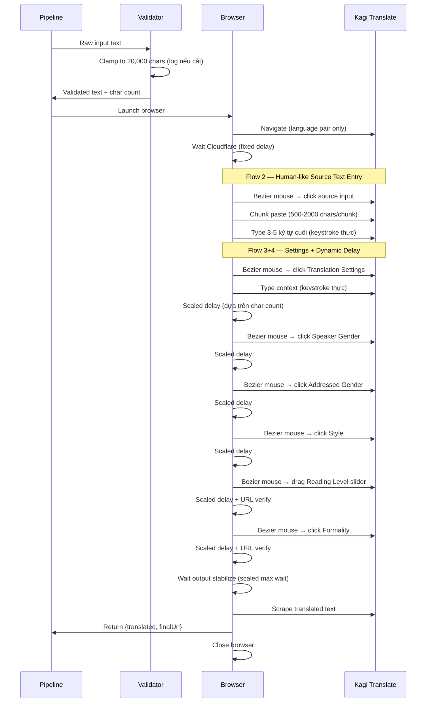

# Core Flows — Kagi Translate Automation Improvements

## Overview

Spec này mô tả các automation pipeline flows sau khi áp dụng cả 3 cải thiện. Đây là tool tự động hóa (không phải UI product), nên flows mô tả chuỗi hành động automation — từ khi nhận input text đến khi trả về kết quả dịch.

Tham chiếu: spec:b6e88b17-57a5-4c01-bc3b-34eb44e842b3/12282019-2b12-422d-96b9-6cc197090226

## Flow 1: Input Text Validation & Clamping

**Mô tả**: Đảm bảo mọi input text đều nằm trong giới hạn an toàn trước khi đưa vào pipeline.

**Trigger**: Automation nhận source text (từ config hoặc runtime parameter).

**Các bước**:

1. Automation nhận raw input text
2. Đo chiều dài ký tự (character count)
3. **Nếu ≤ 20,000 ký tự** → giữ nguyên, tiếp tục pipeline bình thường
4. **Nếu > 20,000 ký tự** → cắt tại đúng 20,000 ký tự, ghi log warning kèm thông tin: độ dài gốc, số ký tự bị cắt bỏ
5. Text đã validate được truyền xuống cho flow nhập liệu

**Kết quả**: Text luôn ≤ 20,000 ký tự trước khi tương tác với browser. Pipeline không bao giờ crash do text quá dài.

## Flow 2: Human-like Source Text Entry

**Mô tả**: Nhập source text vào Kagi Translate theo cách mô phỏng người dùng thật — kết hợp paste theo chunk với keystroke thực cuối cùng.

**Trigger**: Sau khi navigate thành công và Cloudflare đã pass, source text sẵn sàng nhập.

**Các bước**:

1. Clear source text hiện tại trong ô nhập liệu (đảm bảo trạng thái sạch)
2. Di chuột đến ô nhập liệu source text theo đường cong tự nhiên (Bezier curve, có overshoot nhẹ)
3. Click vào ô nhập liệu — click tại điểm ngẫu nhiên trong vùng element, không phải center
4. Dừng ngắn (như người đang đọc placeholder) trước khi bắt đầu nhập
5. **Nếu ≤ 500 ký tự** → gõ toàn bộ bằng keystroke thực (puppeteer-humanize), tốc độ biến thiên, có pause tự nhiên → chuyển đến bước 8
6. **Nếu > 500 ký tự** → chia text thành các chunk (500–2,000 ký tự mỗi chunk, kích thước ngẫu nhiên). Cho mỗi chunk: paste chunk vào editor, chờ delay ngẫu nhiên 200–800ms giữa các chunk (mô phỏng copy-paste từng đoạn)
7. **3–5 ký tự cuối cùng**: gõ từng ký tự bằng keystroke thực với tốc độ typing ngẫu nhiên (mô phỏng người chỉnh sửa cuối text)
8. Blur khỏi ô nhập liệu (mô phỏng người rời focus sau khi nhập xong)

**Ngưỡng chuyển đổi**: 500 ký tự (≈ 1 đoạn văn, ~40-60 giây gõ). Dưới ngưỡng → gõ toàn bộ tự nhiên hơn. Trên ngưỡng → paste tự nhiên hơn.

**Kết quả**: Source text được nhập đầy đủ. Browser nhận cả InputEvent lẫn KeyboardEvent — hỗn hợp tự nhiên như người copy-paste rồi chỉnh sửa.

## Flow 3: Human-like Settings Configuration

**Mô tả**: Cấu hình Translation Settings (context, speaker, addressee, style, reading level, formality) với mọi tương tác mô phỏng hành vi người thật.

**Trigger**: Sau khi source text đã được nhập (Flow 2), automation mở Translation Settings.

**Các bước**:

1. **Mở Translation Settings**

- Di chuột đến nút "Translation Settings" theo đường cong Bezier (có biến thiên tốc độ theo khoảng cách — Fitts's Law)
- Click tại điểm ngẫu nhiên trong vùng nút
- Chờ dialog mở hoàn tất

2. **Nhập Translation Context** (nếu có)

- Di chuột đến textarea context
- Click để focus
- Nhập text context bằng keystroke thực (≤100 ký tự nên gõ từng ký tự với tốc độ biến thiên — có pause sau dấu chấm, tốc độ nhanh hơn ở giữa từ)
- Chờ settle delay (scaled theo input text length) → xác minh URL phản ánh context

3. **Chọn Speaker Gender**

- Di chuột đến option tương ứng theo Bezier
- Click tại điểm ngẫu nhiên
- Chờ settle delay (scaled theo input text length) — Kagi re-translate

4. **Chọn Addressee Gender**

- Tương tự bước 3, di chuột → click → chờ delay scaled

5. **Chọn Translation Style**

- Di chuột → click option Natural/Literal → chờ delay scaled

6. **Kéo Reading Level Slider**

- Di chuột đến vị trí hiện tại của slider handle
- Nhấn giữ chuột (mousedown)
- Kéo ngang theo track đến vị trí target step — trajectory theo Bezier, tốc độ biến thiên (chậm đầu/cuối, nhanh giữa)
- Thả chuột (mouseup) tại target
- Chờ settle delay (scaled) → xác minh URL phản ánh reading level

7. **Chọn Formality**

- Di chuột → click option → xác minh URL → chờ settle delay (scaled)

**Kết quả**: Tất cả settings đã được cấu hình. Mọi tương tác đều có mouse movement tự nhiên, click variance, và tempo giống người thật.

## Flow 4: Dynamic Delay After Settings Change

**Mô tả**: Mỗi khi settings thay đổi trigger Kagi re-translate, thời gian chờ tự động scale theo độ dài input text.

**Trigger**: Bất kỳ settings change nào trong Flow 3 (context, speaker, addressee, style, reading level, formality).

**Các bước**:

1. Settings change được thực hiện (click/drag/type)
2. Tính delay multiplier dựa trên input text character count:

| Input Text Length     | Multiplier | Ví dụ: base 1500ms |
| --------------------- | ---------- | ------------------ |
| ≤ 2,000 chars         | **1.0x**   | 1,500ms            |
| 2,001 – 8,000 chars   | **1.5x**   | 2,250ms            |
| 8,001 – 15,000 chars  | **2.5x**   | 3,750ms            |
| 15,001 – 20,000 chars | **4.0x**   | 6,000ms            |

1. Áp dụng delay scaled = base delay × multiplier (thêm jitter ngẫu nhiên ±10% cho tự nhiên)
2. Sau delay, xác minh URL đã phản ánh settings change
3. Chờ translation output stabilize (thời gian max wait cũng scaled theo cùng multiplier)

### Delays được scale (phụ thuộc API response time)

| Delay                               | Base value | Dùng ở đâu                          |
| ----------------------------------- | ---------- | ----------------------------------- |
| `CONTEXT_URL_SETTLE_MS`             | 1,500ms    | Sau fill context                    |
| Hardcoded delay trước reading level | 2,000ms    | Trước set reading level             |
| Hardcoded delay sau formality       | 2,000ms    | Sau set formality                   |
| `TRANSLATION_OUTPUT_STABLE_MS`      | 1,500ms    | Chờ streaming output ngừng thay đổi |
| `TRANSLATION_OUTPUT_MAX_WAIT_MS`    | 90,000ms   | Max timeout chờ output stabilize    |

### Delays KHÔNG scale (UI interaction, cố định)

- `POST_DIALOG_SETTLE_MS` (400ms) — dialog animation
- `STYLE_OPTION_CLICK_GAP_MS` (200ms) — micro-gap giữa click steps
- `POST_DISMISS_SETTINGS_MS` (200ms) — close animation
- `CLOUDFLARE_VERIFICATION_TIMEOUT_MS` (45,000ms) — Cloudflare, cố định
- Hardcoded 5,000ms — Cloudflare initial wait

## Flow 5: End-to-End Translation Pipeline (Tích hợp)

**Mô tả**: Toàn bộ pipeline từ đầu đến cuối, tích hợp cả 4 flow ở trên.

**Trigger**: Automation được khởi chạy (CLI hoặc Docker).

**Kết quả**: Kết quả dịch được trả về. Toàn bộ quá trình không phân biệt được với người dùng thật trên cả 3 khía cạnh: input timing, interaction patterns, và wait behavior.
