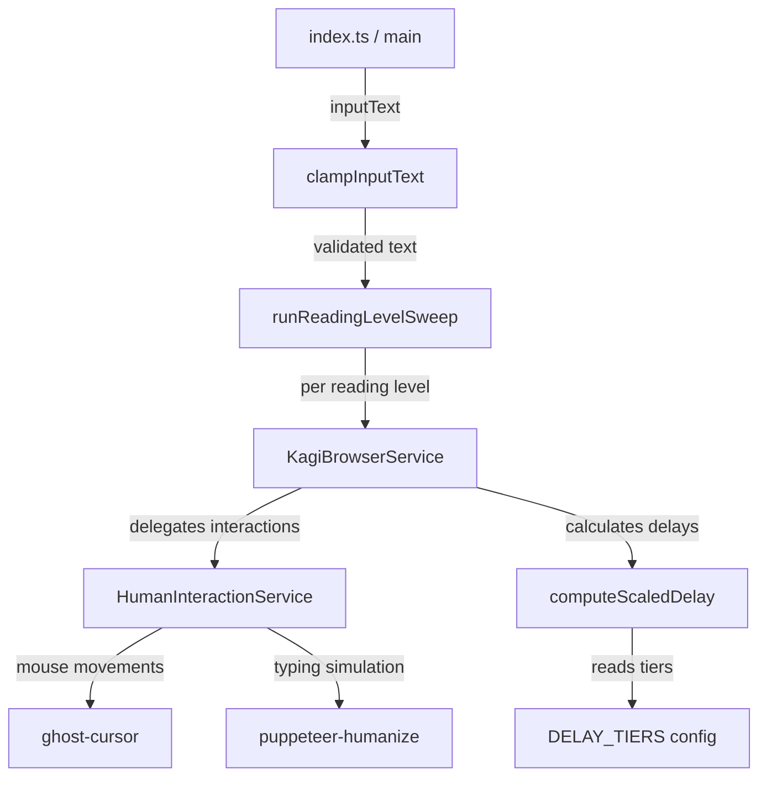
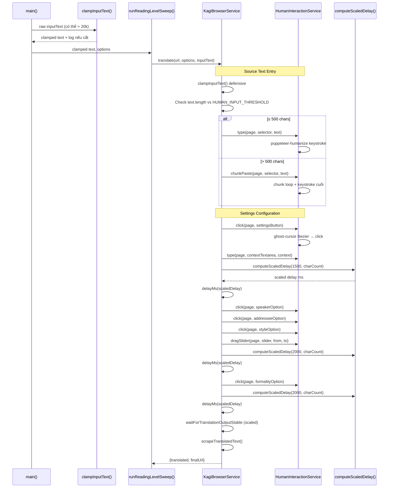

# Tech Plan — Kagi Translate Automation: Robustness & Human-like Behavior

## Tham chiếu

- spec:b6e88b17-57a5-4c01-bc3b-34eb44e842b3/12282019-2b12-422d-96b9-6cc197090226 — Epic Brief
- spec:b6e88b17-57a5-4c01-bc3b-34eb44e842b3/3b02656e-27ff-42ca-bfd2-e0a8be3e2458 — Core Flows

## 1. Architectural Approach

### 1.1 Service Decomposition (SRP)

**Quyết định**: Tách `HumanInteractionService` ra khỏi `KagiBrowserService`.

| Concern                | Owner                                       | Trách nhiệm                                                                                                                         |
| ---------------------- | ------------------------------------------- | ----------------------------------------------------------------------------------------------------------------------------------- |
| Flow orchestration     | `KagiBrowserService`                        | Điều phối 10 bước translate: navigate → Cloudflare → fill text → settings → scrape. Gọi human interaction service cho mọi tương tác |
| Human-like interaction | `HumanInteractionService`                   | Wrap ghost-cursor + puppeteer-humanize. Expose: `humanClick()`, `humanType()`, `humanDragSlider()`, `humanChunkPaste()`             |
| Delay calculation      | Pure functions trong `delay.config.ts`      | `computeDelayMultiplier()`, `computeScaledDelay()` — stateless, side-effect free                                                    |
| Input validation       | Pure function trong `translation.config.ts` | `clampInputText()` — nhất quán với `clampTranslationContext()`                                                                      |

**Rationale**: `KagiBrowserService` hiện 1,077 dòng. Thêm ghost-cursor/puppeteer-humanize logic sẽ đẩy ~1,500+. Tách service giữ mỗi class dưới 800 dòng, testable riêng.

### 1.2 Dependency Strategy

**Quyết định**: Thêm 2 production dependencies.

| Package              | Purpose                                                            | Type       |
| -------------------- | ------------------------------------------------------------------ | ---------- |
| `ghost-cursor`       | Bezier mouse movements, Fitts's Law click, random-point-in-element | production |
| `puppeteer-humanize` | Variable-speed typing, typo simulation, natural pauses             | production |

**Tương thích**:

- **ghost-cursor**: Import `Page` từ `puppeteer`, nhưng `puppeteer-real-browser` trả về `Page` từ `puppeteer-core`. 2 types không interchangeable ở TypeScript level. **Giải pháp**: Cast `page as any` khi truyền vào `createCursor()` + eslint-disable justification. Runtime compatible vì cùng shape. Nếu `remoteObject` API crash → fallback về bounding rect click trong `HumanInteractionService`.
- **puppeteer-humanize**: API là `typeInto(elementHandle, text, config)` — chỉ dùng cho standard `<textarea>` (context textarea). **Không dùng** cho CodeMirror contenteditable (`[aria-label="Source text input"]`) vì không tương thích. Source text input dùng `page.type()` native với variable delay random (50–150ms/keystroke) + pause sau punctuation.

### 1.3 Error Handling — Retry + Fallback

**Quyết định**: Ghost-cursor interaction fail → retry 1 lần → fallback về standard click + log warning.

**Rationale**: Trong Docker/Xvfb, viewport có thể hẹp, bounding rect có thể bất thường. Pipeline không nên crash vì 1 mouse movement fail. Nhưng cần signal rõ ràng (log warning) khi human simulation bị degrade để debug.

**Pattern**:

1. Attempt ghost-cursor `move()` + `click()`
2. Nếu exception → retry 1 lần (element có thể vừa xuất hiện)
3. Nếu retry fail → fallback `page.click(selector)` + `console.warn("⚠️ Degraded to standard click")`

### 1.4 Input Text Clamping — Defensive Layers

**Quyết định**: Clamp tại 2 layers.

| Layer                                                  | Thời điểm                                 | Purpose                                           |
| ------------------------------------------------------ | ----------------------------------------- | ------------------------------------------------- |
| `runReadingLevelSweep()` / `main()`                    | Trước khi truyền `inputText` vào pipeline | Primary guard — log warning chi tiết              |
| `fillSourceTextInput()` bên trong `KagiBrowserService` | Trước khi paste vào CodeMirror            | Defensive guard — silent clamp, không double-warn |

### 1.5 Constraints

- **Không thay đổi \*\***`IBrowserService`\***\* interface** — `translate(url, options, sourceText)` signature giữ nguyên. Human interaction là internal implementation detail.
- **Không thay đổi \*\***`IUrlBuilder`\***\* interface** — URL building không bị ảnh hưởng.
- **`as const`\*\*** pattern\*\* — tier config, thresholds, delay base values đều dùng `as const` nhất quán với `BROWSER_CONFIG`.

## 2. Data Model

Project này không có database. "Data model" ở đây là các TypeScript types/constants/configs mới.

### 2.1 Delay Tier Configuration

```typescript
interface DelayTier {
  readonly maxChars: number
  readonly multiplier: number
}
```

Constant array `DELAY_TIERS` chứa 4 tiers theo thứ tự ascending `maxChars`. Pure function `computeDelayMultiplier(charCount)` tìm tier phù hợp bằng cách scan từ đầu — first match.

### 2.2 Input Text Constants

```typescript
const MAX_INPUT_TEXT_LENGTH = 20_000
```

Thêm vào file:nghien_cuu_cua_toi/src/config/translation.config.ts — cùng vị trí với `MAX_TRANSLATION_CONTEXT_LENGTH = 100`.

### 2.3 Human Interaction Interface

```typescript
interface IHumanInteraction {
  click(page: Page, selector: string): Promise<void>
  clickByTextContent(
    page: Page,
    spanSelector: string,
    text: string,
    matchIndex: number,
  ): Promise<void>
  typeIntoTextarea(page: Page, selector: string, text: string): Promise<void>
  typeIntoContentEditable(page: Page, selector: string, text: string): Promise<void>
  dragSlider(page: Page, sliderSelector: string, fromStep: number, toStep: number): Promise<void>
  chunkPaste(page: Page, selector: string, text: string): Promise<void>
}
```

Interface cho DIP — `KagiBrowserService` depends on abstraction, không phải `ghost-cursor` trực tiếp.

**Method semantics**:

- `click()` — ghost-cursor Bezier move → click element by CSS selector
- `clickByTextContent()` — evaluate tìm element by span text + matchIndex → get bounding rect → ghost-cursor move to rect center ± jitter → click. Dùng cho settings options (speaker, addressee, style, formality)
- `typeIntoTextarea()` — puppeteer-humanize `typeInto()` cho standard `<textarea>` (context textarea)
- `typeIntoContentEditable()` — `page.type()` native với variable delay random (50–150ms) + pause sau punctuation. Dùng cho CodeMirror source input

### 2.4 Scaled Delay Function Signatures

```typescript
function computeDelayMultiplier(charCount: number): number
function computeScaledDelay(baseMs: number, charCount: number): number
```

`computeScaledDelay` = `baseMs × computeDelayMultiplier(charCount)` + jitter ±10%.

### 2.5 Relationships with Existing Types

| Existing                        | New                 | Relationship                                                                                                  |
| ------------------------------- | ------------------- | ------------------------------------------------------------------------------------------------------------- |
| `TranslationOptions`            | —                   | Không thay đổi                                                                                                |
| `IBrowserService`               | —                   | Interface giữ nguyên                                                                                          |
| `BROWSER_CONFIG`                | `DELAY_TIERS`       | `BROWSER_CONFIG` giữ base delay values; `DELAY_TIERS` cung cấp multipliers. `computeScaledDelay` kết hợp cả 2 |
| `clampTranslationContext()`     | `clampInputText()`  | Cùng pattern, cùng file config                                                                                |
| `KagiBrowserService` (concrete) | `IHumanInteraction` | Browser service nhận human interaction qua DI                                                                 |

## 3. Component Architecture

### 3.1 Overview



### 3.2 New Component: `delay.config.ts`

**Vị trí**: file:nghien_cuu_cua_toi/src/config/delay.config.ts

**Trách nhiệm**: Chứa tier configuration và pure functions tính toán delay.

**Exports**:

- `DELAY_TIERS` — readonly array 4 tiers `{ maxChars, multiplier }`
- `HUMAN_INPUT_THRESHOLD` — 500 (ngưỡng chuyển đổi full-typing vs chunk-paste)
- `computeDelayMultiplier(charCount: number): number` — tra bảng tier, trả về multiplier
- `computeScaledDelay(baseMs: number, charCount: number): number` — base × multiplier + jitter ±10%

**Interface với existing**: Import bởi `KagiBrowserService` khi cần tính delay sau mỗi settings change. Import bởi unit tests trực tiếp (pure function → dễ test).

### 3.3 New Component: `HumanInteractionService`

**Vị trí**: file:nghien_cuu_cua_toi/src/services/human-interaction.service.ts

**Interface**: file:nghien_cuu_cua_toi/src/services/interfaces/human-interaction.interface.ts

**Trách nhiệm**: Wrap ghost-cursor và puppeteer-humanize, expose 4 high-level methods.

| Method                                          | Behavior                                                                                                                                                     | Fallback on failure                            |
| ----------------------------------------------- | ------------------------------------------------------------------------------------------------------------------------------------------------------------ | ---------------------------------------------- |
| `click(page, selector)`                         | ghost-cursor Bezier move → random point click within element                                                                                                 | Retry 1x → standard `page.click()` + warn      |
| `clickByTextContent(page, spanSel, text, idx)`  | evaluate → find element by text + index → get bounding rect → ghost-cursor move to rect center ± jitter → click                                              | Retry 1x → evaluate `btn.click()` + warn       |
| `typeIntoTextarea(page, selector, text)`        | puppeteer-humanize `typeInto(elementHandle, text, config)` cho standard `<textarea>`                                                                         | Retry 1x → standard `page.type()` + warn       |
| `typeIntoContentEditable(page, selector, text)` | `page.type(selector, text, {delay: random(50,150)})` + pause sau punctuation. Dùng cho CodeMirror                                                            | Retry 1x → execCommand insertText + warn       |
| `dragSlider(page, sliderSel, fromStep, toStep)` | ghost-cursor mousedown at fromStep position → Bezier drag → mouseup at toStep                                                                                | Retry 1x → evaluate set value trực tiếp + warn |
| `chunkPaste(page, selector, text)`              | Chia text thành chunks (500-2000 chars random), paste mỗi chunk với delay 200-800ms random, type 3-5 ký tự cuối bằng keystroke via `typeIntoContentEditable` | Retry 1x → full execCommand insertText + warn  |

**Lifecycle**: Tạo mới mỗi `translate()` call (vì ghost-cursor `createCursor(page)` cần page instance hiện tại). Không lưu state giữa các calls.

**DI pattern**: `KagiBrowserService` nhận `IHumanInteraction` qua constructor parameter (default: `new HumanInteractionService()`). Tests có thể inject mock.

### 3.4 Modified Component: `KagiBrowserService`

**Thay đổi chính**:

1. **Constructor** nhận optional `IHumanInteraction` dependency
2. **`translate()`\*\*** method\*\* — thay thế tất cả `page.click()`, `page.evaluate()` set value, `btn.click()` bằng calls tới `IHumanInteraction`
3. **Delay calls** — thay `this.delayMs(2_000)` hardcoded bằng `this.delayMs(computeScaledDelay(2000, inputTextLength))` cho 5 delays được scale
4. **`fillSourceTextInput()`** — delegate sang `humanInteraction.chunkPaste()` hoặc `humanInteraction.typeIntoContentEditable()` dựa trên `HUMAN_INPUT_THRESHOLD`
5. **`setReadingLevel()`** — delegate sang `humanInteraction.dragSlider()` thay vì `evaluate()` set value trực tiếp
6. **`clickSettingsOptionBySpanLabel()`** — delegate sang `humanInteraction.clickByTextContent()` thay vì `btn.click()`. `clickTranslationSettingsButton()` delegate sang `humanInteraction.click()` (CSS selector).
7. **`fillTranslationContext()`** — delegate sang `humanInteraction.typeIntoTextarea()` (standard textarea)
8. **Input text clamping** — gọi `clampInputText()` trong `fillSourceTextInput()` (defensive layer)

**Không thay đổi**: `launch()`, `close()`, `scrapeTranslatedText()`, URL verification methods, Cloudflare wait logic.

### 3.5 Modified Component: `translation.config.ts`

**Thay đổi**:

- Thêm `MAX_INPUT_TEXT_LENGTH = 20_000`
- Thêm `clampInputText(raw: string): string` — pattern giống `clampTranslationContext()`
- Re-export từ file:nghien_cuu_cua_toi/src/config/index.ts

### 3.6 Modified Component: `index.ts` / `runReadingLevelSweep`

**Thay đổi**: Gọi `clampInputText()` trên input text trước khi truyền vào `runReadingLevelSweep()`. Log warning nếu truncate xảy ra.

### 3.7 Integration Flow (End-to-End Trace)



### 3.8 Testing Strategy

| Component                        | Test approach                                                                   | File                                      |
| -------------------------------- | ------------------------------------------------------------------------------- | ----------------------------------------- |
| `computeDelayMultiplier()`       | Unit test: boundary values (0, 2000, 2001, 8000, 15000, 20000)                  | `delay.config.test.ts`                    |
| `computeScaledDelay()`           | Unit test: verify multiplier × base, jitter range ±10%                          | `delay.config.test.ts`                    |
| `clampInputText()`               | Unit test: ≤20k pass-through, >20k truncate, empty string, undefined            | `translation.config.test.ts` (extend)     |
| `HumanInteractionService`        | Unit test với mock Page — verify ghost-cursor methods called, fallback behavior | `human-interaction.service.test.ts`       |
| `KagiBrowserService` integration | E2E test update — verify scaled delays áp dụng, human methods invoked           | `translation-mocked.e2e.test.ts` (extend) |
